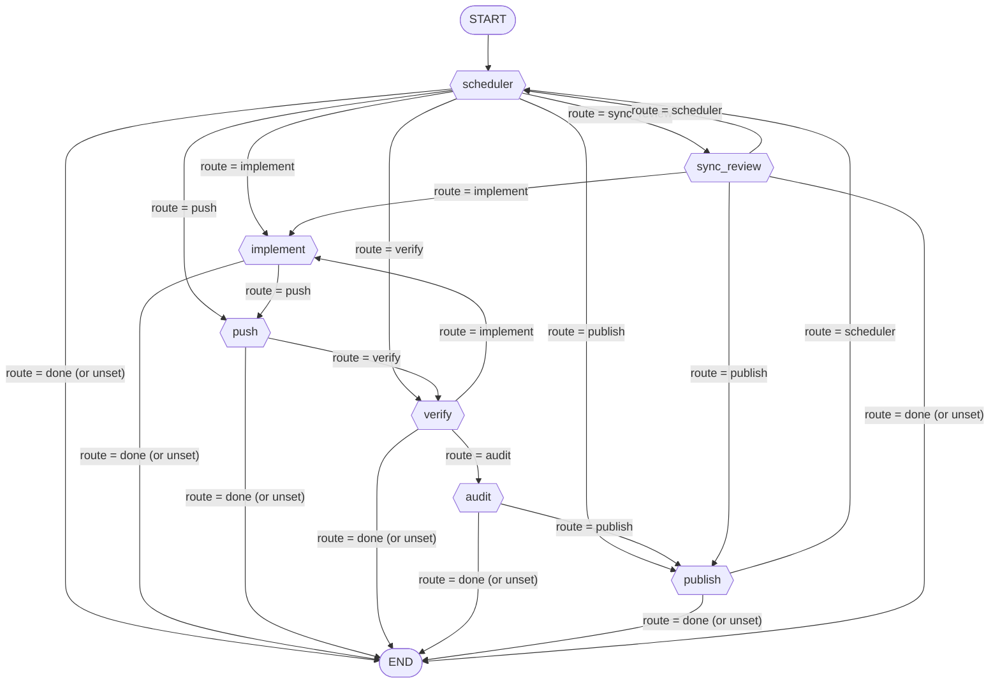

# Coding Graph

The coding graph is **one reconciliation tick** over a single project's build manifest. A tick
reclaims dead leases, picks exactly one task, advances it as far as it safely can — provision,
implement, push, verify, audit, publish, or sync a review decision off GitHub — and then returns.
There is no in-graph waiting and no human-in-the-loop interrupt: *"retry" is simply another tick*.
The previous interrupt-driven topology was removed because its durable state lived in a LangGraph
checkpoint keyed to the caller's session, so a halted run could not be resumed from anywhere else
(C4/C5). Durable state now lives where it can be inspected and hand-edited: the manifest on disk,
the git repository, and the pull requests on GitHub ([graph.py:L1-L7](file:///Users/alvac/aoc/graphs/coding/graph.py#L1-L7)).

> [!IMPORTANT]
> The graph compiles with `checkpointer=None` even when the loader passes one. A checkpoint would
> reintroduce exactly the resume problem this design removed.

## Workflow


```mermaid
flowchart TD
    START([START]) --> scheduler

    scheduler{{scheduler}}
    implement{{implement}}
    push{{push}}
    verify{{verify}}
    audit{{audit}}
    publish{{publish}}
    sync_review{{sync_review}}
    END([END])

    scheduler -->|"route = implement"| implement
    scheduler -->|"route = push"| push
    scheduler -->|"route = verify"| verify
    scheduler -->|"route = publish"| publish
    scheduler -->|"route = sync_review"| sync_review
    scheduler -->|"route = done (or unset)"| END

    implement -->|"route = push"| push
    implement -->|"route = done (or unset)"| END

    push -->|"route = verify"| verify
    push -->|"route = done (or unset)"| END

    verify -->|"route = audit"| audit
    verify -->|"route = implement"| implement
    verify -->|"route = done (or unset)"| END

    audit -->|"route = publish"| publish
    audit -->|"route = done (or unset)"| END

    publish -->|"route = scheduler"| scheduler
    publish -->|"route = done (or unset)"| END

    sync_review -->|"route = implement"| implement
    sync_review -->|"route = publish"| publish
    sync_review -->|"route = scheduler"| scheduler
    sync_review -->|"route = done (or unset)"| END
```

Topology and allowed route sets are declared in
[create_graph()](file:///Users/alvac/aoc/graphs/coding/graph.py#L23-L92).

Four rationale notes are embedded in the edges themselves:

- **`implement` can only go to `push`.** A worker that produced nothing ends the tick rather than
  testing an unchanged tree; the next tick retries within the implement budget
  ([graph.py:L58-L62](file:///Users/alvac/aoc/graphs/coding/graph.py#L58-L62)).
- **Every attempt is pushed before it is tested.** Verification runs against the commit on GitHub,
  not this host's worktree, and the remote branch is what lets another host resume. A failed push
  ends the tick and is retried on the next one, within the push budget
  ([graph.py:L64-L69](file:///Users/alvac/aoc/graphs/coding/graph.py#L64-L69)).
- **`audit` has no path back to the worker.** The audit is advisory, so its verdict rides along to
  the PR and the tick carries on to publish
  ([graph.py:L75-L79](file:///Users/alvac/aoc/graphs/coding/graph.py#L75-L79)).
- **`publish` never loops in-process.** A transient failure is retried by the *next* tick, so one
  tick cannot spin on a GitHub outage
  ([graph.py:L81-L85](file:///Users/alvac/aoc/graphs/coding/graph.py#L81-L85)).

## The Tick Model

Routing is done by a single router factory,
[`_router(allowed)`](file:///Users/alvac/aoc/graphs/coding/graph.py#L47-L51):

```python
def _router(allowed):
    def route(state: CodingState):
        value = state.get("route")
        return value if value in allowed else END
    return route
```

`route` is a **persistent LangGraph channel**, declared on `CodingState`
([schemas.py:L159-L162](file:///Users/alvac/aoc/graphs/coding/schemas.py#L159-L162)). Because it is
a channel it survives until a node overwrites it, so every router reads it as an **explicit
instruction** rather than inferring the next step. If the value is not one of that router's own
options — including a route nobody set, or a node's `"done"` sentinel — the tick **ends**. A node
that forgets to set a route stops the tick instead of re-running whatever the last node asked for.

> [!NOTE]
> `route` must be declared as a channel or LangGraph drops it between nodes and *every* conditional
> edge falls through to `END`. This is precisely what the end-to-end tests in
> [test_graph.py](file:///Users/alvac/aoc/tests/graphs/coding/test_graph.py#L81-L88) exist to catch;
> unit tests calling nodes directly cannot.

**What ends a tick:**

- the scheduler finds nothing to do (empty queue, all tasks leased, concurrency bound reached,
  or the polling window is closed) — it emits `"done"`;
- a missing `build_request_path`, a failed preflight, a repo that cannot be resolved, a lost lease
  race, a failed worktree provision, or a failed setup command;
- any node that halts or yields a task (`route: "done"`): exhausted implement budget, a worker that
  modified no files, a push failure or a push refused for the default branch, a missing
  `verification_command`, a missing `head_sha`, an environment-class verification failure, an
  unverified `head_sha` at publish, a PR failure;
- `publish` and `sync_review` routing back to `scheduler`, which then finds no *unhandled* task
  (`tick_handled` guarantees one tick cannot work the same task twice).

**What a subsequent tick resumes from:** the task's recorded `stage` in the manifest.
[`select_task()`](file:///Users/alvac/aoc/graphs/coding/nodes/scheduler.py#L44-L86) maps stage →
route so work already done is not redone: `awaiting_review`/`published` → `sync_review`,
`verified`/`audited` → `publish`, `pushed` → `verify`, `implemented` → `push`, anything else →
`implement`. Every node additionally opens with a `stage_at_or_past(...)` guard backed by evidence,
not a flag. Between implement and push — the only window in which the work exists solely as an
uncommitted worktree — that evidence is the worktree content digest (`impl_digest`). Past
`pushed` it is the **commit SHA**: verify skips only when `verified_sha == head_sha`, audit only
when `audited_sha == head_sha`, and publish refuses to open a PR unless `verified_sha == head_sha`.
A SHA is identical on every host and on GitHub, so a resumed tick on a different machine reaches
the same verdict.

## State

### `CodingState` ([schemas.py:L115-L183](file:///Users/alvac/aoc/graphs/coding/schemas.py#L115-L183))

`total=False` TypedDict. Grouped as in the source.

| Field | Type | Description |
|---|---|---|
| `build_request_path` | `str` | Absolute path to this project's `build_request.json`. The one required input. |
| `project_name` | `str` | Project name, from kwargs/query or the manifest. |
| `target_repo` | `str` | `owner/repo`, legacy top-level form of `repo.slug`. |
| `repo` | `RepoDescriptor` | The repository block declared in the manifest. |
| `max_concurrency` | `int` | Upper bound on live leases before a tick declines to pick up work. |
| `queue` | `List[TaskEnvelope]` | The manifest queue as loaded by the scheduler. |
| `completed_tasks` | `List[str]` | Task ids with status `done` (written on idle exits). |
| `failed_tasks` | `List[str]` | Task ids with status `failed`/`halted`/`blocked` (idle exits). |
| `run_id` | `str` | Per-task run identifier; names the worktree directory. |
| `thread_id` | `str` | Caller thread, defaults to `session_id`. |
| `session_id` | `str` | Caller session, if any. |
| `channel` | `str` | Channel the worker call is attributed to; defaults `coding-pipeline`. |
| `current_task` | `TaskEnvelope` | The one task this tick is advancing. Nodes feed writes back into it. |
| `project_path` | `str` | Spec directory, `pkm/wiki/software/<project>`. |
| `workspace_path` | `str` | Worktree directory, `<repo_root>/workspaces/runs/<run_id>`. |
| `branch_name` | `str` | `feat/<project>/<feature>_<run_id>`. |
| `base_branch` | `str` | Override for the branch a new worktree is based on. |
| `base_ref` | `str` | Alternate override; falls back to `origin/<default_branch>`. |
| `spec_path` | `str` | Path to the task's spec file. |
| `implementation_summary` | `str` | Worker's summary of what it changed; goes into the PR body. |
| `test_run_passed` | `bool` | Whether the verification command exited 0. |
| `test_stdout` | `str` | Verification stdout. |
| `test_stderr` | `str` | Sanitized failure output, fed back to the worker on retry. |
| `modified_files` | `List[str]` | From `git status --porcelain` — never the model's own file list. |
| `diff_summary` | `str` | Sanitized diff the audit reviewed. |
| `pr_url` | `str` | PR URL, only ever set from a `gh`-confirmed response. |
| `pr_number` | `Optional[int]` | PR number. |
| `latest_human_feedback` | `str` | Chat nudge passed to the worker as feedback (never an approval). |
| `github_pr_comments` | `List[str]` | New reviewer comments harvested from the PR. |
| `commit_url` | `str` | Merge commit URL once the PR lands. |
| `error_message` | `str` | Fatal-for-this-tick message; `format_output` renders it with 🛑. |
| `messages` | `List[AnyMessage]` | Seeded with the incoming query as a `HumanMessage`. |
| `route` | `str` | The tick channel: `implement`/`push`/`verify`/`audit`/`publish`/`sync_review`/`scheduler`/`done`. |
| `stage` | `TaskStage` | Stage reached by `current_task` during this tick. |
| `graph_id` | `str` | `"coding"`, read from `graph.json`; the authority field for the worker's tool roster. |
| `required_tools` | `List[str]` | Derived from `graph.json`'s `tools` grant — the grant *is* the requirement. |
| `audit_passed` | `bool` | Advisory audit verdict. |
| `audit_feedback` | `str` | Advisory audit findings; posted to the PR, and re-prompted to the worker. |
| `reviewers` | `List[str]` | GitHub logins whose signals count. |
| `approval_signals` | `Optional[List[str]]` | Overrides `DEFAULT_APPROVAL_SIGNALS`. |
| `rejection_signals` | `Optional[List[str]]` | Overrides `DEFAULT_REJECTION_SIGNALS`. |
| `lease_owner` | `str` | This tick's lease owner id (`<host>:tick_<hex>` when not supplied). |
| `impl_digest` | `Optional[str]` | Worktree digest after implement (meaningful only until push). |
| `head_sha` | `str` | Commit `push` sent to the task branch. Set by the scheduler from the task, reset per task. |
| `verified_sha` | `str` | The `head_sha` verification passed on. Set by the scheduler from the task, reset per task. |
| `poll_until` | `Optional[float]` | Epoch until which the scheduled tick keeps checking GitHub. |
| `repo_root` | `str` | Checkout the tick works against: project root (`self`) or the cached clone. |
| `tick_report` | `List[str]` | Lines the runner posts. Accumulated across the whole tick. |
| `tick_handled` | `List[str]` | Task ids already touched — one tick cannot work the same task twice. |

### `TaskEnvelope` ([schemas.py:L48-L102](file:///Users/alvac/aoc/graphs/coding/schemas.py#L48-L102))

One queue entry in the manifest.

| Field | Type | Description |
|---|---|---|
| `task_id` | `str` | Unique id within the manifest. |
| `project_name` | `str` | Owning project. |
| `feature_name` | `str` | Used to build the branch name. |
| `spec_path` | `str` | Path to the spec the worker and critic read. |
| `dependencies` | `List[str]` | Prerequisite task ids; gated on *completion*, not on a branch existing. |
| `allowed_files` | `List[str]` | Strict filesystem whitelist handed to the worker. |
| `setup_command` | `Optional[str]` | Run once per worktree before any code is written. Falls back to the manifest-level `setup_command`. |
| `setup_done` | `bool` | Reset whenever the worktree is re-created. |
| `verification_command` | `str` | The CLI test command. Absence halts the task as a config error. |
| `acceptance_criteria` | `str` | Given-When-Then criteria. |
| `status` | `TaskStatus` | v3 vocabulary, legacy values still readable. |
| `run_id` | `Optional[str]` | Run that owns the worktree. |
| `branch_name` | `Optional[str]` | Feature branch. |
| `target_repo` | `Optional[str]` | Per-task repo override. |
| `pr_url` | `Optional[str]` | Confirmed PR URL. |
| `commit_url` | `Optional[str]` | Merge commit URL. |
| `error_message` | `Optional[str]` | Legacy free-text error. |
| `stage` | `TaskStage` | Where the task got to — the resume point. |
| `attempts` | `Dict[str, int]` | Per-stage counters, e.g. `{"implement": 2, "publish": 1}`, so a flaky `gh` does not burn the LLM budget (B1). |
| `lease_owner` | `Optional[str]` | Holder of the current claim. |
| `lease_expires_at` | `Optional[float]` | Epoch expiry of the claim. |
| `impl_digest` | `Optional[str]` | Digest of the *uncommitted* worktree after implement. Only meaningful between implement and push, on the host that ran implement — once committed, every tree would share one digest. |
| `verified_digest` | `Optional[str]` | **Legacy** (pre-SHA); read by nothing new. |
| `head_sha` | `Optional[str]` | The commit on the task branch that the later stages vouch for; recorded by `push`. Unique per attempt and identical on every host and on GitHub. |
| `verified_sha` | `Optional[str]` | The `head_sha` verification passed on. "Already verified" means `verified_sha == head_sha`. |
| `audited_sha` | `Optional[str]` | The `head_sha` the advisory audit ran for. |
| `review_cursor` | `Optional[str]` | Highest review comment id already actioned (E5). |
| `review_feedback` | `Optional[List[str]]` | Reviewer comments harvested but not yet acted on. Durable so feedback survives a hand-off through the scheduler (e.g. re-provisioning on another host); cleared once implement consumes it. |
| `poll_until` | `Optional[float]` | Review polling window; outside it the task is dormant. |
| `last_error` | `Optional[TaskError]` | Classified last failure. |
| `updated_at` | `float` | Set on every manifest write. |

### `TaskError` ([schemas.py:L37-L45](file:///Users/alvac/aoc/graphs/coding/schemas.py#L37-L45))

| Field | Type | Description |
|---|---|---|
| `stage` | `str` | Where it failed (`provision`, `setup`, `implement`, `push`, `verify`, `publish`, `merge`, `control`, …). |
| `kind` | `str` | `llm` \| `verification` \| `git` \| `github` \| `config` \| `environment` \| `operator` \| `unknown`. Infrastructure failures must not consume the LLM budget. |
| `message` | `str` | Human-readable detail. |
| `at` | `float` | Epoch timestamp. |

### `RepoDescriptor` ([schemas.py:L105-L112](file:///Users/alvac/aoc/graphs/coding/schemas.py#L105-L112))

| Field | Type | Description |
|---|---|---|
| `mode` | `"self" \| "existing" \| "create"` | Where the checkout comes from. |
| `slug` | `Optional[str]` | `owner/repo` on GitHub. |
| `default_branch` | `str` | Base for new worktrees and PRs. |
| `visibility` | `"private" \| "public"` | Used by `gh repo create`. |
| `push_identity` | `Optional[str]` | GitHub login of the machine user, if any. The token itself is read from a file outside the repo. |
| `push_identity_email` | `Optional[str]` | Commit author email for that identity. |

### Literals and constants

- `TaskStatusV3` — `queued`, `active`, `awaiting_review`, `done`, `failed`, `halted`, `blocked`.
- `TaskStatusLegacy` — `pending`, `in_progress`, `in_review`, `completed`, `rejected`; accepted on
  read and mapped by `migrate_manifest`. Nothing writes them any more.
- `TaskStatus` — the union of both, since a manifest on disk may predate the migration.
- `TaskStage` / `STAGE_ORDER` — `queued` → `provisioned` → `implemented` → `pushed` → `verified`
  → `audited` → `published` → `awaiting_review` → `merged` → `done`. Every stage is the output of
  exactly one node, which is what makes "never redo the LLM part" true after an infrastructure
  failure. `implemented` means written in the worktree but uncommitted and local only; `pushed`
  means committed and pushed to the task branch with `head_sha` recorded.

## Nodes

### scheduler

[scheduler.py:L89-L282](file:///Users/alvac/aoc/graphs/coding/nodes/scheduler.py#L89-L282) ·
[`select_task()`](file:///Users/alvac/aoc/graphs/coding/nodes/scheduler.py#L44-L86) ·
[`_resolve_base_ref()`](file:///Users/alvac/aoc/graphs/coding/nodes/scheduler.py#L286-L299)

**Responsibility.** The entry node of every tick. It decides *what* to advance, in a fixed order:
reclaim dead leases, respect the concurrency bound, pick one task, preflight before any token is
spent, resolve the repository, claim the task with a lease, provision and set up its worktree, and
route by the task's recorded stage.

**Reads:** `build_request_path`, `lease_owner`, `tick_handled`, `tick_report`, `project_name`,
`repo`, `max_concurrency`, `graph_id`, `required_tools`, `base_branch`/`base_ref`, `error_message`.

**Writes:** `build_request_path` (resolved), `project_name`, `repo`, `repo_root`, `queue`,
`current_task`, `route`, `stage`, `run_id`, `branch_name`, `workspace_path`, `spec_path`, `pr_url`,
`head_sha`, `verified_sha` (both taken from the task, reset per task so a channel left over from the
previous task in the same tick cannot stand in for this one's commit), `lease_owner`,
`tick_handled`, `tick_report`, `error_message`; on idle exits also `completed_tasks` and
`failed_tasks`.

**Routes:**

| Route | Meaning |
|---|---|
| `sync_review` | An `awaiting_review` task inside its polling window, or a runnable task whose stage is `awaiting_review`/`published`. Reviews go first: they are cheap, they unblock dependents, and a merge may make another task runnable in the same tick. |
| `publish` | A runnable task already at stage `verified` or `audited` — no LLM needed. |
| `verify` | A runnable task at stage `pushed` — it only needs testing. |
| `push` | A runnable task at stage `implemented` — written but not yet pushed. |
| `implement` | Anything else runnable. Also a task at stage `implemented` whose worktree had to be re-created: that unpushed work was lost, so the task is reset to `provisioned` with `impl_digest` cleared. |
| `done` | No `build_request_path`; concurrency bound reached; nothing runnable; preflight failed; repo unavailable; lease lost to another tick; worktree provisioning failed; setup command failed. Ends the tick. |

**Side effects.** Manifest: `reclaim_expired_leases`, `acquire_lease`, `persist_task` (status,
stage, `run_id`, `branch_name`, `setup_done`, `impl_digest` reset, halts with `last_error`). Git:
[`provision_worktree`](file:///Users/alvac/aoc/core/util/git_ops.py#L146-L208) (idempotent and
**remote-aware**: if `origin/<branch>` exists it is checked out with `worktree add -B`, so a task
that pushed on another host resumes from its commits; otherwise it starts from the base. Skipped
for `sync_review` — a review that needs the worker and finds no worktree hands the task back, and
the next tick provisions it). Network: `preflight_tick` (tool-roster check, push-identity resolution, push access),
`ensure_repo_available` (clone/fetch/`gh repo create`). Shell: the task's `setup_command`, once per
worktree — **only with the `local` verify backend**. With a remote backend (`e2b`) the sandbox runs
setup itself, so this host never executes a project's install scripts.

> [!NOTE]
> Preflight runs only *after* a task has been selected. Running it earlier would make an empty
> queue cost a network round trip on every scheduled tick. Setup failures are recorded as
> `environment`, never against the implement budget — the code is not what went wrong. Dependents
> branch from the default branch, not from a prerequisite's branch, which the merge has deleted by
> then (F3).

### implement

[implement.py:L40-L195](file:///Users/alvac/aoc/graphs/coding/nodes/implement.py#L40-L195) ·
[`_review_feedback()`](file:///Users/alvac/aoc/graphs/coding/nodes/implement.py#L212-L220)

**Responsibility.** The **only** node that calls the LLM to write code. It touches nothing outside
the worktree: no git mutation, no network, no manifest beyond its own bookkeeping. That separation
is the point — when the push later fails, the next tick resumes at `push` and this node is skipped
entirely, because its output is still in the worktree and its digest still matches. Once pushed,
progress is tracked by commit SHA and this node is not consulted again.

**Reads:** `build_request_path`, `current_task` (`task_id`, `stage`, `impl_digest`, `attempts`,
`spec_path`, `allowed_files`, `acceptance_criteria`, `verification_command`, `review_feedback`),
`workspace_path`, `spec_path`, `test_stderr`, `audit_feedback`, `github_pr_comments`,
`latest_human_feedback`, `graph_id`, `channel`, `tick_report`. Reviewer comments come from state
`github_pr_comments` **or** the task's durable `review_feedback`, which covers a hand-off through
the scheduler (e.g. re-provisioning on another host) where the in-memory comments did not survive.

**Writes:** `current_task` (refreshed from the manifest write, including the new attempt count),
`stage`, `route`, `impl_digest`, `modified_files`, `implementation_summary`, `tick_report`,
`error_message`; and clears the consumed feedback channels `test_stderr`, `audit_feedback`,
`latest_human_feedback`, `github_pr_comments`.

**Routes:**

| Route | Meaning |
|---|---|
| `push` | Files changed (or the stage guard matched an unchanged digest, so the LLM was skipped entirely). Push commits this attempt to the task branch; verify then tests that commit. |
| `done` | No `task_id`; implement budget exhausted (`MAX_IMPLEMENT_ATTEMPTS = 3`, task halted); worker modified no files (task yielded back to the queue with no stage advance, so the next tick retries); worker was blocked by a missing permission (halted as `config`). |

**Side effects.** Worker subprocess via
[`call_worker`](file:///Users/alvac/aoc/graphs/coding/utils/worker.py#L78-L93) →
`agent_call` on `graph-worker`. Read-only git: `git status --porcelain` for the true file list, and
`git diff HEAD` + status for the digest. Manifest: `bump_attempt`, `persist_task` (stage
`implemented`, `impl_digest`, `review_feedback=None` — the feedback is consumed), `yield_task`.

> [!IMPORTANT]
> The attempt count must travel in `current_task`, not only to disk. `current_task` is the snapshot
> the scheduler took at the start of the tick and `verify` reads the budget off it — leaving it
> stale meant `verify` saw 0 attempts every time, so `implement → verify → implement` never
> terminated and one tick burned the whole recursion limit on LLM calls.

A worker reply of "I was not allowed to" is not a worker that failed to think; three more attempts
cannot grant it a tool, so a blocked reply halts instead of retrying. `git` is ground truth for what
changed — the model's own `<modified_files>` list is ignored (§7.6).

### push

[push.py:L33-L127](file:///Users/alvac/aoc/graphs/coding/nodes/push.py#L33-L127)

**Responsibility.** Commit the worker's change and push it to the task branch, straight after
implement and before anything tests it. No LLM. The commit message is
`feat(<project>): <task_id> (attempt n)`; once pushed, the new HEAD is recorded as `head_sha` via
[`git_ops.rev_parse`](file:///Users/alvac/aoc/core/util/git_ops.py#L211-L216) and the task advances
to stage `pushed`.

**Reads:** `build_request_path`, `current_task` (`task_id`, `stage`, `head_sha`, `branch_name`,
`attempts`), `workspace_path`, `branch_name`, `repo`, `project_name`, `tick_report`.

**Writes:** `current_task` (refreshed from the manifest write), `stage` (`pushed`), `head_sha`,
`route`, `tick_report`, `error_message`.

**Routes:**

| Route | Meaning |
|---|---|
| `verify` | The attempt was committed and pushed, and HEAD resolved; or the guard matched (stage at or past `pushed` and the task already has a `head_sha`). |
| `done` | No `task_id`; branch empty or equal to the default branch (halt, `config` — attempts must never land on the default branch); worktree missing (yield — the uncommitted change is gone, and the scheduler sends the task back to implement); push failed or HEAD could not be resolved (kind `git`, `push` attempt counter bumped, task yielded keeping stage `implemented` so the next tick re-enters here; halts after `MAX_PUSH_ATTEMPTS = 3`). |

**Side effects.** Git/GitHub:
[`commit_and_push`](file:///Users/alvac/aoc/core/util/git_ops.py#L257-L332) (treats "nothing to
commit" as success, so a retry is idempotent), `git rev-parse HEAD`. Manifest: `bump_attempt`
(`push`), `yield_task`, `persist_task` (stage `pushed`, `head_sha`, halts with `last_error`).

> [!NOTE]
> Why push moved here from publish: verification will run remotely (E2B) and fetches the commit
> from GitHub — the sandbox never sees this host's disk — and the remote branch is the source of
> truth, so a tick on a *different host* can resume from `origin/<branch>`. Neither works for code
> that only exists in a local worktree. `head_sha` then names exactly what verify and audit looked
> at, so their guards compare SHAs instead of digesting a tree that may not exist on this host.
> Every attempt is a commit on the task branch only; failed attempts stay in the branch history and
> the PR squash-merges them away. Push failures retry within their own budget, never the LLM's.

### verify

[verify.py:L96-L310](file:///Users/alvac/aoc/graphs/coding/nodes/verify.py#L96-L310) ·
[`classify_failure()`](file:///Users/alvac/aoc/graphs/coding/nodes/verify.py#L63-L93) ·
[`_run()`](file:///Users/alvac/aoc/graphs/coding/nodes/verify.py#L324-L348)

**Responsibility.** The only **blocking** quality gate. Runs the task's `verification_command`
against the pushed `head_sha` with a 600-second timeout, through the runner the manifest's
`environment` block selects (`environment.backend`, else `$CODING_VERIFY_BACKEND`, else `local`).
The runner gets `meta={task_id, head_sha, repo, push_identity}` so a remote backend can fetch that
exact commit from GitHub. A backend that starts from nothing (`runs_setup`, i.e. `e2b`) also gets
the project's `setup_command` as a first step. A pass is recorded against the commit as
`verified_sha = head_sha`.

**Reads:** `build_request_path`, `current_task` (`task_id`, `stage`, `head_sha`, `verified_sha`,
`verification_command`, `setup_command`, `environment`, `attempts`), the manifest's `environment`
and `setup_command`, `repo`, `workspace_path`, `tick_report`.

**Writes:** `current_task`, `stage`, `route`, `test_run_passed`, `test_stdout`, `test_stderr`
(sanitized), `tick_report`, `error_message`.

**Routes:**

| Route | Meaning |
|---|---|
| `audit` | The command exited 0 (persists `verified_sha = head_sha` and clears the `infra` counter), or this exact commit already passed (stage at or past `verified` and `verified_sha == head_sha`). |
| `implement` | A genuine test failure with implement budget left — the output is handed back to the worker. Writes the *cleared* digest and real attempt count into `current_task`. |
| `done` | No `task_id`; no `verification_command` (halt, `config`); no `head_sha` (yield at stage `implemented`, so the next tick re-pushes); workspace missing (yield keeping the stage — the code is on the remote, and the next tick re-provisions from `origin/<branch>`); the **runner** failed (`infra_error`: sandbox did not start, source download failed — `infra` counter bumped, yield at stage `pushed`, halt after `MAX_INFRA_ATTEMPTS = 3`, implement budget untouched); setup failed in the sandbox, or changed tracked files (halt, `environment`); the failure was classified `environment` (halt, implementation left alone); budget exhausted (halt). |

**Side effects.** The verification command via the
[sandbox](file:///Users/alvac/aoc/graphs/coding/utils/sandbox/__init__.py) runner from
`get_runner(environment)`: a host subprocess for `local`, a throwaway E2B sandbox for `e2b`.
Manifest: `persist_task` / `yield_task` / `bump_attempt` (`infra`).

> [!NOTE]
> Two things this node deliberately does *not* do: it does not require a PR to exist — gating local
> tests behind a network operation is what turned a GitHub hiccup into "tests failed" (A3) — and it
> does not re-run for a commit it has already tested. `classify_failure` is conservative on purpose:
> anything it cannot *prove* is an environment problem stays `verification` and goes back to the
> worker, because misreading a real test failure as a broken environment would halt a task one more
> attempt would have fixed. The converse case (a missing dependency handed to the worker) is what
> produced 25 rewrites of a correct implementation.

### audit

[audit.py:L27-L74](file:///Users/alvac/aoc/graphs/coding/nodes/audit.py#L27-L74) ·
[`_run_audit()`](file:///Users/alvac/aoc/graphs/coding/nodes/audit.py#L96-L126)

**Responsibility.** Advisory anti-pattern review of the diff against the spec — Fake It Trap, Happy
Path Bias, Silent Failure, Bloated Files. The work is committed by now, so `git diff HEAD` would be
empty: the diff reviewed is the whole branch against the default branch it was cut from
(`base...HEAD`).

**Reads:** `build_request_path`, `current_task` (`task_id`, `stage`, `head_sha`, `audited_sha`,
`spec_path`, `acceptance_criteria`, `allowed_files`), `workspace_path`, `repo`, `spec_path`,
`channel`, `graph_id`, `tick_report`.

**Writes:** `stage` (`audited`), `route`, `audit_passed`, `audit_feedback`, `diff_summary`,
`tick_report`, `error_message`.

**Routes:**

| Route | Meaning |
|---|---|
| `publish` | Always — whether the audit passed, raised concerns, was already done for this commit (stage at or past `audited` and `audited_sha == head_sha`), or could not run at all. |
| `done` | Only when `current_task` has no `task_id`. |

**Side effects.** Read-only git:
[`get_branch_diff(ws, "origin/<default_branch>")`](file:///Users/alvac/aoc/core/util/git_ops.py#L219-L233)
(falls back to the uncommitted diff if the base cannot be resolved). Worker subprocess via
`call_worker` for the critic verdict. Manifest: `persist_task(stage="audited", audited_sha=head_sha)`.

> [!IMPORTANT]
> The audit is **always advisory, and that is not configurable**. The critic is good at catching a
> fake implementation that passes its own tests and bad at judging whether a 200-line file is a
> problem, so its opinion is written into the PR for the human reviewer instead of blocking the
> pipeline. A mode that *could* gate on this verdict would be an untested path behind a flag, one
> parser slip away from bouncing correct work back to the worker. An audit that cannot run is not a
> rejection either: the old critic failed closed and blocked the pipeline whenever the LLM call
> errored, which would now spam every PR with a message about the auditor rather than the code.

### publish

[publish.py:L36-L134](file:///Users/alvac/aoc/graphs/coding/nodes/publish.py#L36-L134) ·
[`_retry_or_halt()`](file:///Users/alvac/aoc/graphs/coding/nodes/publish.py#L137-L163) ·
[`_upsert_pull_request()`](file:///Users/alvac/aoc/graphs/coding/nodes/publish.py#L166-L201)

**Responsibility.** Upsert the pull request and post the review context onto it. It **no longer
commits or pushes** — the branch is already on GitHub (`push` sent it straight after implement, and
`verify` tested that exact commit), so publish only opens or adopts the PR, and refuses to open one
for a commit that verify did not pass. Everything here is deterministic and idempotent, and
**nothing here calls the LLM** — which is what makes retrying safe: if `gh` is down, the next tick
re-enters with the same code and spends no tokens.

**Reads:** `build_request_path`, `current_task` (`task_id`, `head_sha`, `verified_sha`, `pr_url`,
`target_repo`, `spec_path`, `verification_command`), `workspace_path`, `branch_name`, `repo`,
`target_repo`, `base_branch`, `pr_url`, `implementation_summary`, `spec_path`, `test_run_passed`,
`audit_feedback`, `tick_report`.

**Writes:** `stage` (`awaiting_review`), `pr_url`, `pr_number`, `head_sha`, `poll_until`, `route`,
`tick_report`, `error_message`.

**Routes:**

| Route | Meaning |
|---|---|
| `scheduler` | The PR is open and the task is now `awaiting_review`. Control returns to the scheduler, which may pick up a *different* task in the same tick (`tick_handled` prevents re-picking this one). |
| `done` | No `task_id`; no branch; no `head_sha` (task yielded at stage `implemented`, so the next tick re-pushes); `verified_sha != head_sha` (task yielded at stage `pushed`, so the next tick re-verifies before any PR is opened); PR could not be opened (retries within the publish budget, `MAX_PUBLISH_ATTEMPTS = 3`, on later ticks, then halts). |

**Side effects.** GitHub: `gh pr list` / `get_pull_request_status` / `create_pull_request`,
`comment_pull_request`. Manifest: `bump_attempt`, `yield_task`, `persist_task` (status
`awaiting_review`, `pr_url`, `pr_number`, `head_sha`, `poll_until = now + 1h`, lease released).

Two rules from §6.3 hold throughout:

- **A URL is only reported if `gh` confirmed it.** Fabricated links (D2) are gone, so a link in the
  channel is proof the PR exists.
- **A pushed branch is never thrown away.** If the PR call fails, the task halts with a
  clickable compare URL, and the next tick *adopts* the PR you open from it — `_upsert_pull_request`
  always looks before creating.

Publishing failures retry within their own budget, never the LLM's, and the lease is handed back
rather than held: holding it over a transient `gh` failure would keep the task invisible until the
lease expired. A failure to post the review-context comment is logged and never fatal — the PR
exists and is reviewable, and losing a comment must not halt a task or trigger a retry.

### sync_review

[sync_review.py:L159-L260](file:///Users/alvac/aoc/graphs/coding/nodes/sync_review.py#L159-L260) ·
[`evaluate_signals()`](file:///Users/alvac/aoc/graphs/coding/nodes/sync_review.py#L56-L116) ·
[`harvest_comments()`](file:///Users/alvac/aoc/graphs/coding/nodes/sync_review.py#L119-L156) ·
[`_finish()`](file:///Users/alvac/aoc/graphs/coding/nodes/sync_review.py#L263-L318)

**Responsibility.** Read the human decision off GitHub and act on it. **GitHub is the only approval
surface**: there is no interrupt, no chat approval and no keyword classification.

**Reads:** `build_request_path`, `current_task` (`task_id`, `pr_url`, `pr_number`, `review_cursor`),
`pr_url`, `workspace_path`, `repo`, `target_repo`, `reviewers`, `approval_signals`,
`rejection_signals`, `lease_owner`, `tick_report`.

**Writes:** `stage`, `github_pr_comments`, `commit_url`, `route`, `tick_report`, `error_message`.

Signals, first match wins:

| # | Approval | What it is |
|---|---|---|
| 1 | `merged_manually` | PR state is `MERGED` — terminal, checked first |
| 2 | `review_approved` | a native review by a listed reviewer |
| 3 | `label:approved` | the `approved` label |
| 4 | `comment:/approve` | a comment whose **first line** is exactly `/approve` |

Rejections are symmetric — `changes_requested`, `comment:/reject` (back to the worker) and
`comment:/abort` (fail the task and tear down) — and are evaluated *before* approvals, so a label
added after a "request changes" does not override it. A `CLOSED` PR is an abort.

**Routes:**

| Route | Meaning |
|---|---|
| `publish` | There is no PR URL to sync against; fall back to publish, which adopts an existing PR for the branch if there is one. |
| `implement` | Changes requested, or new unresolved reviewer comments, and the worktree exists on this host. Task returns to stage `provisioned`, digest cleared, `review_cursor` advanced, comments persisted as `review_feedback`. |
| `scheduler` | Terminal or no-op outcomes: merged/approved-and-merged (task `done`, worktree torn down), aborted (task `failed`, worktree removed), an approval whose merge failed (stays `awaiting_review`, retried in 15 minutes), or nothing new (lease released so the next tick can look again). Also changes requested / new comments when the worktree **does not exist on this host**: the task is yielded at stage `provisioned` (cursor advanced, `review_feedback` persisted, lease released) so the next tick re-provisions from `origin/<branch>` and implement reads the comments off the manifest. |
| `done` | Only when `current_task` has no `task_id`. |

**Side effects.** GitHub: `get_pull_request_status`, `get_unresolved_review_threads`,
`merge_pull_request` (squash, delete branch). Git: `teardown_worktree`. Manifest: `persist_task`
(status `done`/`failed`/`active`, stage, `review_cursor`, `review_feedback`, `poll_until`,
`commit_url`), `yield_task` (missing worktree), `release_lease`.

> [!NOTE]
> [`first_line_command()`](file:///Users/alvac/aoc/graphs/coding/nodes/sync_review.py#L36-L46)
> matches the first line **exactly**. Prose cannot trigger it, a quoted `/approve` cannot, and a
> code block mentioning it cannot — this is the direct fix for the gate that read "ok" inside
> "looks broken" and defaulted to *approved* when it found nothing (E1, E2). Comment harvesting
> excludes the machine user (otherwise the system reacts to its own test-result comments) and
> ignores ids at or below `review_cursor`, so a resume does not re-action a comment already
> addressed (E5). Inline review threads live in a different API from issue comments and are fetched
> separately; a review written entirely on the lines would otherwise look like silence.

## Durable State

There is no checkpointer. Everything a later tick needs is on disk or on GitHub.

**The manifest — [utils/manifest.py](file:///Users/alvac/aoc/graphs/coding/utils/manifest.py)** is
the system of record, one `build_request.json` per project. Three properties make that safe:

1. **Atomic writes** — temp file in the same directory, then `os.replace`, so a crash mid-write
   leaves the previous manifest intact rather than a truncated one. A corrupt manifest raises
   rather than being silently replaced by an empty one, which would look like "all tasks finished".
2. **Locked read-modify-write** — `locked_manifest()` and `persist_task()` re-read under an
   exclusive `flock` (on a sidecar `.lock` file, because the atomic write replaces the inode) and
   write back the merged document. Nodes used to rewrite the whole document from memory, so two
   writers silently lost each other's updates.
3. **Leases** — a task claimed by a process that then dies is reclaimed on the next tick at its
   recorded stage, which turns "stuck in_progress forever" into automatic crash recovery.

The manifest **is the API**: hand-editing the JSON and running another tick is a supported
operation, and that is exactly what
[utils/control.py](file:///Users/alvac/aoc/graphs/coding/utils/control.py) does — nothing in the
control plane runs the pipeline, it only makes a task runnable and lets the next tick pick it up.

**The git repo — [utils/repo.py](file:///Users/alvac/aoc/graphs/coding/utils/repo.py)** holds the
actual work. The worktree under `workspaces/runs/<run_id>` carries an attempt only between
implement and push; from then on the task branch carries it. The checkout itself is resolved from `repo.mode`: `self` (this
process's own repository, rooted by walking up to the `.git` marker — never `os.getcwd()`),
`existing` (a managed clone at `workspaces/repos/<owner>__<repo>`, fetched not re-cloned), or
`create` (`gh repo create`, then behave as `existing`).

**GitHub** holds the task branch from the **first attempt** and the review state after publish.
`push.py` writes the branch — every attempt is a commit on it, never on the default branch, and
the PR squash-merges the history away. Verification fetches that commit (it will run remotely, on
E2B, and never sees this host's disk), and the remote branch is the source of truth, so a tick on a
*different host* can resume: [`provision_worktree`](file:///Users/alvac/aoc/core/util/git_ops.py#L146-L208)
checks out `origin/<branch>` (`worktree add -B`) when it exists and only starts from the base
otherwise. `publish.py` writes the PR and review-context comment; `sync_review.py` reads it back
(PR state, review decision, labels, issue comments, unresolved inline threads). Approval exists
nowhere else — a nudge in chat reopens the polling window and is passed to the worker as feedback,
but it is not an approval.

**The DAG — [utils/dag.py](file:///Users/alvac/aoc/graphs/coding/utils/dag.py)** is the queue
itself. `get_runnable_tasks()` evaluates topological dependencies over the manifest: status
`queued`/`pending`, all dependencies *completed*, not currently leased. Dependencies gate on
completion rather than on the prerequisite's branch existing, so a dependent cannot start against a
branch the merge deleted (F3). There is one manifest per project and deliberately no global
fallback — a run that was never told which project it was for used to find *a* queue, the wrong one.

**How a new tick rebuilds context.** It is handed only a `build_request_path`. From there:
`reclaim_expired_leases` frees anything a dead process held; `load_manifest` (migrating v1/v2 to v3
in memory) restores the queue, repo descriptor, reviewers and concurrency bound; `select_task`
picks one task and reads its `stage` as the resume point; `ensure_repo_available` and the
remote-aware provisioning guard restore or reuse the worktree from `origin/<branch>`; past
`pushed`, `head_sha` against `verified_sha` / `audited_sha` proves whether the previous tick's test
result and audit still describe the code on the branch (`impl_digest` covers only the unpushed gap
between implement and push; `verified_digest` is legacy); `review_feedback` restores reviewer
comments not yet acted on; `attempts` restores the per-stage budgets; `pr_url` and `review_cursor`
restore the review conversation. Nothing depends on the caller who started the previous tick, or
on the host it ran on.

## Utilities

| Module | Purpose |
|---|---|
| [dag.py](file:///Users/alvac/aoc/graphs/coding/utils/dag.py) | Manifest path resolution (one per project under `pkm/wiki/software/<slug>/`), project-slug normalisation, manifest discovery, and topological selection of runnable tasks. |
| [manifest.py](file:///Users/alvac/aoc/graphs/coding/utils/manifest.py) | Durable persistence: atomic writes, `flock`-protected read-modify-write, v1/v2→v3 migration, per-stage attempt counters, leases and their reclamation, and the `stage_at_or_past` guard every node opens with. |
| [control.py](file:///Users/alvac/aoc/graphs/coding/utils/control.py) | Operator control plane — `status_report`, `retry`, `reset`, `skip`, `abort`, `unblock`, and the host switch `handoff` / `resume`. Every task operation is a manifest write; `reset` is the only destructive one. `reset` clears `head_sha`/`verified_sha`/`audited_sha`/`review_feedback` with the rest of [`RESET_FIELDS`](file:///Users/alvac/aoc/graphs/coding/utils/control.py#L31-L49); `retry` with a `from_stage` clears `verified_sha`/`audited_sha` (and the digests) so the guards cannot skip the work being redone. |
| [host.py](file:///Users/alvac/aoc/graphs/coding/utils/host.py) | Which host is ticking: host-tagged lease owners, the local pause file, `CODING_TICK_ENABLED`, and an immediate pkm sync. See [Moving between hosts](#moving-between-hosts-nas--dev-box). |
| [repo.py](file:///Users/alvac/aoc/graphs/coding/utils/repo.py) | Repository descriptor defaults, machine-user (`push_identity`) resolution, project-root detection, and the `self`/`existing`/`create` repository modes. |
| [worker.py](file:///Users/alvac/aoc/graphs/coding/utils/worker.py) | The single place the graph reaches `graph-worker`, so the call always carries this graph's binding. `graph_id` is the authority field that decides the worker's tool roster. |
| [shell.py](file:///Users/alvac/aoc/graphs/coding/utils/shell.py) | One implementation of "run a command in a worktree", returning `(exit_code, stdout, stderr)` and never raising. Shared by setup and verify so they cannot disagree on what a failure means. |
| [sandbox/](file:///Users/alvac/aoc/graphs/coding/utils/sandbox/__init__.py) | Verification runners. `VerifyRunner` / `RunResult` keep a command's verdict separate from a runner's own failure (`infra_error`); `LocalRunner` wraps `shell.py`; [`E2BRunner`](file:///Users/alvac/aoc/graphs/coding/utils/sandbox/e2b_runner.py) creates a sandbox, downloads `head_sha` via a short-lived codeload URL (the only credential the sandbox sees), runs setup + verify under `bash -o pipefail`, fails a setup that edits tracked files, and always kills the sandbox (key: `$E2B_API_KEY` or `./e2b_api_key`; template: `environment.template` / `$CODING_E2B_TEMPLATE`); `get_runner()` picks the backend from the manifest's `environment.backend` or `CODING_VERIFY_BACKEND` (default `local`), and raises on an unknown name rather than falling back to the host. |
| [digest.py](file:///Users/alvac/aoc/graphs/coding/utils/digest.py) | SHA-256 over `git diff HEAD` plus sorted `git status --porcelain`, so "already implemented" is a claim with evidence. Only meaningful between implement and push — once committed, the diff is empty; past `pushed`, the commit SHA is the evidence. `None` means *no evidence* and must be treated as a cache miss. |
| [preflight.py](file:///Users/alvac/aoc/graphs/coding/utils/preflight.py) | Checks, before any token is spent, that the worker really receives the tools `graph.json` grants it and that the push identity can push. Resolves the roster through the same `worker_session` factory the real call uses. |
| [token_opt.py](file:///Users/alvac/aoc/graphs/coding/utils/token_opt.py) | Truncates tracebacks (head + tail) and diffs before they enter a prompt — the failing case produces the longest output and is exactly when the spec risks being crowded out. |
| [xml_parsers.py](file:///Users/alvac/aoc/graphs/coding/utils/xml_parsers.py) | Parses the `<worker_handoff>`, `<critic_verdict>` and `<spec_validation_result>` blocks. Verdicts match **exactly**, never as substrings, so an echoed placeholder reads as FAIL/REJECT. |

## Entry & Exit

### `prepare_input()`

[adapters.py:L8-L114](file:///Users/alvac/aoc/graphs/coding/adapters.py#L8-L114)

Translates an incoming text query plus kwargs into the initial `CodingState`. It:

- prefixes the query with `<caller>…</caller>` when a caller is supplied;
- resolves `project_name`, `project_path`, `build_request_path` and `target_repo` from kwargs
  first, then by regex over the query text; `project_path` defaults to
  `pkm/wiki/software/<project>` and `build_request_path` to that project's `build_request.json`;
- **requires a manifest.** If none can be resolved it does not raise — it returns an
  `error_message` telling the caller exactly what to pass. Which manifest is the one required
  input, the way `topic` is for content creation: without it a run has no queue, and guessing one
  means working through some other project's tasks;
- treats a chat nudge containing approve/lgtm/yes/revise/abort/cancel/proceed as
  `latest_human_feedback` — **not** as an approval, which is read only off GitHub;
- loads `graph_id` and `required_tools` from `graph.json`, deriving the tool requirement from the
  grant itself so there is no second list that can drift;
- loads reviewers, approval/rejection signals and the repo descriptor from the manifest,
  read-only and failure-tolerant (a missing manifest simply means no reviewers configured, and the
  scheduler reports the empty queue);
- seeds `tick_report`, `tick_handled`, `completed_tasks`, `failed_tasks` and `messages`.

### `format_output()`

[adapters.py:L164-L177](file:///Users/alvac/aoc/graphs/coding/adapters.py#L164-L177), delegating to
[`format_tick_report()`](file:///Users/alvac/aoc/graphs/coding/adapters.py#L151-L161)

Renders `error_message` as `🛑 Coding tick error: …` if set, otherwise joins the non-empty
`tick_report` lines.

> [!NOTE]
> **Empty output is meaningful, not a bug.** The scheduled runner treats empty stdout as "post
> nothing", which is what keeps a channel usable when the queue is idle 287 times out of 288 a day.

### `create_graph(checkpointer=None, **kwargs)`

[graph.py:L23-L92](file:///Users/alvac/aoc/graphs/coding/graph.py#L23-L92)

The loader hands every graph a checkpointer
([graph_builder.py:L137-L144](file:///Users/alvac/aoc/core/agent/graph_builder.py#L137-L144)), so
the parameter is accepted — but it is **deliberately ignored**, and the workflow always compiles
with `checkpointer=None`. It is not silently honoured, because a checkpoint would key durable state
to the caller's session again, which is exactly the resume problem this design removed. Durable
state lives in the manifest, git and GitHub instead.
[test_graph.py:L19-L44](file:///Users/alvac/aoc/tests/graphs/coding/test_graph.py#L19-L44) asserts
both that `graph.checkpointer is None` and that a supplied `MemorySaver` is refused.

### How a tick is driven

- **Scheduled:** [scripts/coding_tick.py](file:///Users/alvac/aoc/scripts/coding_tick.py) is run by
  the `script-executor` cron every five minutes. It discovers every project manifest, calls
  `create_graph().ainvoke(prepare_input(...))` once per `--max-tasks`, and prints only the tick
  report — the runtime's own chatter is captured and discarded so it does not become the message.
- **Interactive:** [tools/graph_call.py](file:///Users/alvac/aoc/tools/graph_call.py) invokes the
  graph through the loader's registered `prepare_input`. The `coding` graph belongs to
  `software-planner` ([agents/main/AGENTS.md](file:///Users/alvac/aoc/agents/main/AGENTS.md#L31)).
- **Operator:** [scripts/coding_admin.py](file:///Users/alvac/aoc/scripts/coding_admin.py) and
  [tools/graph_status.py](file:///Users/alvac/aoc/tools/graph_status.py) go through
  `utils/control.py` — manifest writes only, never an execution path of their own.

### Moving between hosts (NAS ↔ dev box)

The task's code lives on its `origin/<branch>` from the first attempt, and the manifest lives in
the pkm repo, so any host can pick a task up. Only **one host may tick at a time**: two would each
commit their own copy of the manifest, and the pkm sync keeps one. Which host runs the scheduled
tick is already decided by Discord agent ownership — the tick is a `script-executor` schedule, and
[schedule_runner.py](file:///Users/alvac/aoc/core/scheduler/schedule_runner.py#L234-L244) only runs
an agent's schedules on the host that owns it. What ownership cannot do is carry state across the
switch, so the switch has three steps:

1. **Old host:** `scripts/coding_admin.py handoff` —
   [`control.handoff()`](file:///Users/alvac/aoc/graphs/coding/utils/control.py) pauses ticking
   here, waits for ticks still running here (exit 3 and nothing synced if any are; re-run later),
   pushes any task stuck at `implemented` (its work exists only on this disk), then syncs the pkm
   repo immediately instead of at the hourly sync.
2. **Discord control thread:** `[claim script-executor]` from the dev box, or `[release]` to give
   it back to prod.
3. **New host:** `scripts/coding_admin.py resume` — pulls pkm first, refuses while another host
   still holds a live lease (`--force` overrides), then unpauses.

Every step is idempotent. The moving parts live in
[utils/host.py](file:///Users/alvac/aoc/graphs/coding/utils/host.py):

| Piece | What it does |
|---|---|
| Host-tagged leases | The scheduler claims as `<host>:tick_<hex>` (`CODING_HOST_NAME` overrides the hostname, useful in containers), so `status` shows where a task is worked and `handoff` can tell its own in-flight ticks from another host's. A legacy owner without a host counts as "maybe this host". |
| Pause file | `sessions/coding_tick.paused` (gitignored, so local to one host). Set by `handoff`, cleared by `resume`. Also stops manual `coding_tick.py` runs, which ownership does not gate. |
| `CODING_TICK_ENABLED` | Per-deployment hard switch; `0` means this host never ticks, whatever the pause file says. |

A paused or disabled host's `coding_tick.py` exits 0 silently and its `has_work` reports no work, so
the scheduler does not even spawn it; `--dry-run` still works for checking a handoff.

## Files

| Path | Description |
|---|---|
| [graph.py](file:///Users/alvac/aoc/graphs/coding/graph.py) | The topology: seven nodes, the `_router` factory, and `create_graph()` compiling without a checkpointer. |
| [schemas.py](file:///Users/alvac/aoc/graphs/coding/schemas.py) | `CodingState`, `TaskEnvelope`, `TaskError`, `RepoDescriptor`, and the status/stage vocabularies. |
| [adapters.py](file:///Users/alvac/aoc/graphs/coding/adapters.py) | `prepare_input()`, `format_tick_report()`, `format_output()`, and the `graph.json`/manifest settings readers. |
| [graph.json](file:///Users/alvac/aoc/graphs/coding/graph.json) | Graph id, description, and the `tools` grant (`bash` and `filesystem`, scoped to `workspaces/runs` and `pkm/wiki/software`) that preflight asserts against. |
| [__init__.py](file:///Users/alvac/aoc/graphs/coding/__init__.py) | Package marker. |
| [nodes/](file:///Users/alvac/aoc/graphs/coding/nodes/__init__.py) | The seven stages of a tick, re-exported in execution order. |
| [nodes/scheduler.py](file:///Users/alvac/aoc/graphs/coding/nodes/scheduler.py) | Reclaim, preflight, select, claim, provision (remote-aware), set up, and route by stage. |
| [nodes/implement.py](file:///Users/alvac/aoc/graphs/coding/nodes/implement.py) | The only node that calls the LLM to write code. |
| [nodes/push.py](file:///Users/alvac/aoc/graphs/coding/nodes/push.py) | Commits each attempt and pushes it to the task branch; records `head_sha`. No LLM. |
| [nodes/verify.py](file:///Users/alvac/aoc/graphs/coding/nodes/verify.py) | Runs the verification command against `head_sha`; classifies environment vs. verification failure. |
| [nodes/audit.py](file:///Users/alvac/aoc/graphs/coding/nodes/audit.py) | Advisory anti-pattern review of the branch diff; always continues to publish. |
| [nodes/publish.py](file:///Users/alvac/aoc/graphs/coding/nodes/publish.py) | PR upsert + review-context comment, only for a verified `head_sha`. Deterministic, idempotent, no LLM. |
| [nodes/sync_review.py](file:///Users/alvac/aoc/graphs/coding/nodes/sync_review.py) | Reads the decision off GitHub, merges or sends work back, tears down. |
| [utils/](file:///Users/alvac/aoc/graphs/coding/utils/__init__.py) | Support modules — see [Utilities](#utilities). |
| [prompts/](file:///Users/alvac/aoc/graphs/coding/prompts/__init__.py) | Prompt builders for the Goldfish workers. |
| [prompts/coder_prompt.py](file:///Users/alvac/aoc/graphs/coding/prompts/coder_prompt.py) | Coder worker prompt: execution boundary, allowed files, acceptance criteria, plus targeted retry blocks for test output, critic feedback and human feedback. |
| [prompts/critic_prompt.py](file:///Users/alvac/aoc/graphs/coding/prompts/critic_prompt.py) | Critic prompt: spec + diff against the four-item anti-pattern checklist. |
| [prompts/spec_validator_prompt.py](file:///Users/alvac/aoc/graphs/coding/prompts/spec_validator_prompt.py) | Spec validator prompt. Not used by any node — consumed by [tools/spec_validator.py](file:///Users/alvac/aoc/tools/spec_validator.py) before a task is queued. |

Tests live in [tests/graphs/coding/](file:///Users/alvac/aoc/tests/graphs/coding/) — one module per
node and per utility, plus
[test_graph.py](file:///Users/alvac/aoc/tests/graphs/coding/test_graph.py), which drives the
*compiled* graph end to end. Only a compiled run catches a route that no declared channel carries,
and it also enforces that no node both calls the LLM and mutates a remote.
