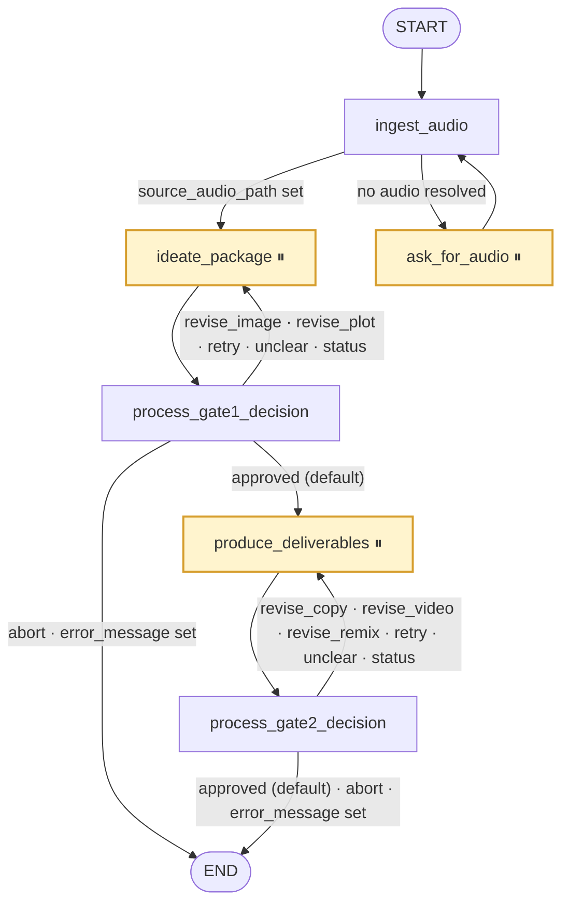

# Content Creation Graph

An audio-in, deliverables-out media pipeline. The graph takes a topic plus a source audio clip and
produces a base image, a video plot document, an animated plate, a remixed master video (audio +
styled subtitles), and publication copy — all written to deterministic paths under `output_path`.
Work is organised into three high-cohesion *macro nodes* (`ingest_audio`, `ideate_package`,
`produce_deliverables`) separated by **two human-in-the-loop (HITL) approval gates**: Gate 1 signs
off the image and video plot, Gate 2 signs off the finished package. Each gate is implemented as an
`interrupt_after` pause followed by a dedicated *gate processor* node that is the only place in the
graph where a human message is parsed into a routable decision.

> [!IMPORTANT]
> The rule the gate processors enforce, verbatim from [gates.py](file:///Users/alvac/aoc/graphs/content_creation/nodes/gates.py#L1-L15):
> *an unrecognised message must never reach a node that can spend money.* Image generation and Veo
> renders are paid actions, so anything the deterministic parser cannot place stops at the gate.

## Workflow



⏸ = listed in `interrupt_after`: execution halts **after** the node runs, leaving the downstream node
scheduled in `snapshot.next`. See [create_graph()](file:///Users/alvac/aoc/graphs/content_creation/graph.py#L72-L153).

Router details:

| Router | Source | Logic |
|---|---|---|
| [check_audio_router](file:///Users/alvac/aoc/graphs/content_creation/graph.py#L95-L104) | `ingest_audio` | `ideate_package` if `source_audio_path` is truthy, else `ask_for_audio` |
| [gate1_router](file:///Users/alvac/aoc/graphs/content_creation/graph.py#L115-L129) | `process_gate1_decision` | `abort` → END; then `error_message` → END; then revise/retry/NO_WORK → `ideate_package`; otherwise → `produce_deliverables` |
| [gate2_router](file:///Users/alvac/aoc/graphs/content_creation/graph.py#L134-L148) | `process_gate2_decision` | `abort` → END; then `error_message` → END; then revise/retry/NO_WORK → `produce_deliverables`; otherwise → END |

> [!NOTE]
> `abort` is checked **before** `error_message`, and the gate processor clears `error_message` when
> it parses a `retry` — which is what makes the "reply `retry`" advertised in error cards actually
> reachable. Every other intent defers to a sticky error and routes to END.

## Human-in-the-Loop Gates

### The interrupt / resume mechanism

The graph is compiled with `interrupt_after=["ask_for_audio", "ideate_package", "produce_deliverables"]`
([graph.py:150-153](file:///Users/alvac/aoc/graphs/content_creation/graph.py#L150-L153)). When one of
those nodes finishes, LangGraph checkpoints the state and stops; `graph.get_state(config).next` then
holds the node that *would* have run (`ingest_audio`, `process_gate1_decision`, or
`process_gate2_decision`). The macro node's last act is to push the gate card onto `messages`, so the
caller sees the card as the reply.

A human resumes via [graph_call](file:///Users/alvac/aoc/tools/graph_call.py#L74-L134), which:

1. Detects the pause (`snapshot.next` non-empty ⇒ `is_interrupted`).
2. Writes the reply into state as `latest_human_feedback`, `query`, and a `HumanMessage`, using
   `as_node=<the node that fed the pending target>` so progression is not reset to `__start__`.
3. Calls `graph.ainvoke(None, config=config)`, which continues at the pending gate processor.

The gate processor ([`_process_gate`](file:///Users/alvac/aoc/graphs/content_creation/nodes/gates.py#L45-L142))
records a decision in `gate1_decision` / `gate2_decision`, and the router does the rest. If there is
no human message at all, the resume is treated as "nothing to decide" and the previously recorded
decision is preserved (defaulting to `approved`).

### Gate 1 — after `ideate_package`

| Decision value | Next node | Meaning |
|---|---|---|
| `approved` | `produce_deliverables` | Image + plot signed off; proceed to production |
| `revise_image` | `ideate_package` | Regenerate the base image (archives the old one) |
| `revise_plot` | `ideate_package` | Redraft the video plot |
| `retry` | `ideate_package` | Clears `error_message` / `quota_exceeded`, re-runs ideation |
| `abort` | `END` | Stop the run |
| `unclear` | `ideate_package` | **NO_WORK** — re-present Gate 1 with a clarification card |
| `status` | `ideate_package` | **NO_WORK** — re-present Gate 1 with a read-only status card |

Menu ordinals (from [gate_menu](file:///Users/alvac/aoc/graphs/content_creation/utils/classifiers.py#L206-L221)):
`1` image, `2` plot, `3` approve, `4` abort.

### Gate 2 — after `produce_deliverables`

| Decision value | Next node | Meaning |
|---|---|---|
| `approved` | `END` | Final package signed off |
| `revise_copy` | `produce_deliverables` | Redraft publication copy |
| `revise_video` | `produce_deliverables` | Re-render the Veo plate **and** re-remix |
| `revise_remix` | `produce_deliverables` | Re-run the ffmpeg audio/subtitle remix only |
| `retry` | `produce_deliverables` | Clears `error_message` / `quota_exceeded`, re-runs production |
| `abort` | `END` | Stop the run |
| `unclear` | `produce_deliverables` | **NO_WORK** — re-present Gate 2 with a clarification card |
| `status` | `produce_deliverables` | **NO_WORK** — re-present Gate 2 with a read-only status card |

Menu ordinals: `1` video, `2` remix, `3` copy, `4` approve, `5` abort.

> [!NOTE]
> Gate 2 has **no `image` target**. There is no edge from Gate 2 back to ideation, so accepting one
> would regenerate nothing and then present a video still built from the previous image. A request
> for it is rejected with an explanation
> ([classifiers.py:250-255](file:///Users/alvac/aoc/graphs/content_creation/utils/classifiers.py#L250-L255)).

### NO_WORK decisions and the `pending_notice` short-circuit

`NO_WORK = ("unclear", "status")` ([graph.py:110-113](file:///Users/alvac/aoc/graphs/content_creation/graph.py#L110-L113)).
Both route *back to the presenting macro node* — which sounds expensive, but is free:

* The gate processor sets `pending_notice` to the rendered card (clarification or status).
* `ideate_package` / `produce_deliverables` check `pending_notice` **first** and return
  `{"messages": [AIMessage(pending_notice)]}` before any generator runs
  ([ideate_package_node.py:15-21](file:///Users/alvac/aoc/graphs/content_creation/nodes/ideation/ideate_package_node.py#L15-L21),
  [produce_deliverables_node.py:16-20](file:///Users/alvac/aoc/graphs/content_creation/nodes/production/produce_deliverables_node.py#L16-L20)).
* Because those nodes are interrupt points, returning the card is exactly equivalent to re-asking:
  the run parks at the same gate, ready for the answer.

`pending_feedback` preserves the human's **original wording** alongside the notice. When the human
answers the menu with an ordinal, `parse_intent` uses `pending_feedback` as the revision instruction
— so being asked to clarify never costs them what they typed
([classifiers.py:303-323](file:///Users/alvac/aoc/graphs/content_creation/utils/classifiers.py#L303-L323)).
[`looks_like_instruction`](file:///Users/alvac/aoc/graphs/content_creation/utils/classifiers.py#L358-L373)
decides whether a *new* unclear message supersedes the stored one: menu-shaped replies (`3`, `1+2`)
and bare rejections (`no`) are answers to the card, not new requests, so they do not overwrite it.
Any clear decision resets both channels via
[`_cleared()`](file:///Users/alvac/aoc/graphs/content_creation/nodes/gates.py#L35-L42) — leaving
either set would re-present the gate forever.

### How a message becomes a decision

[`parse_intent`](file:///Users/alvac/aoc/graphs/content_creation/utils/classifiers.py#L263-L355) is a
two-tier, deterministic parser. It never raises and never guesses.

* **T0 — deterministic.** The whole NFKC-normalised, whitespace-collapsed, end-punctuation-stripped
  message must match a gate-specific grammar *exactly*. A T0 match is the only thing allowed to
  trigger a paid action. Matching is **whole-message equality**, never substring — so `"not good"`
  is not `"good"`, the bug class that used to make `"no, revise it"` read as an approval.
* **T1 — unclear.** Everything else. Nothing is generated, overwritten, or spent.

Recognised T0 forms, in evaluation order:

| Form | Example | Result |
|---|---|---|
| Abort set | `abort`, `cancel`, `stop`, `quit`, `nevermind` | `ABORT` |
| Retry set | `retry`, `try again`, `again` | `RETRY` |
| Status set | `status`, `?`, `where are we` | `STATUS` |
| Approval set | `approve`, `lgtm`, `ship it`, `yes`, `ok`, `👍` | `APPROVE` |
| Rejection set | `no`, `not good`, `meh`, `👎` | `UNCLEAR` + "reads as a rejection, but doesn't say what to change" |
| Multi-ordinal | `1+2`, `1, 3` | `UNCLEAR` — "one change at a time" |
| Ordinal | `2` | The menu entry at that index; a revise entry needs `pending_feedback`, else `UNCLEAR` |
| `revise <target>: <instruction>` | `revise image: make the hat red` (also `redo`/`regenerate`/`change`/`fix`/`update`, `-`/`–`/`—` separators) | `REVISE` with that target |
| `revise <target>` (bare) | `revise plot` | `REVISE` using `pending_feedback`, else `UNCLEAR` |
| `set style/aspect/duration <x>` | `set style ghibli` | `UNCLEAR` — recognised but deliberately not wired up yet |

Target words are resolved through an alias table (`pic`/`artwork` → `image`, `motion prompt` →
`plot`, `plate`/`animation` → `video`, `subtitles`/`audio`/`font` → `remix`, `caption`/`hashtags` →
`copy`) and only inside the explicit revise forms — aliases are never scanned for in free text.
`Intent.decision(gate)` then maps `(gate, target)` onto the legacy strings the routers consume via
[`_DECISION`](file:///Users/alvac/aoc/graphs/content_creation/utils/classifiers.py#L64-L70).

When the target is `remix`,
[`extract_remix_parameters`](file:///Users/alvac/aoc/graphs/content_creation/utils/classifiers.py#L376-L450)
pulls `audio_start_time`, `text_start_time`, `text_end_time`, `font_size`, `position`, and
`font_color` out of the instruction and merges them into `remix_params`. It is a *parameter*
extractor, not a classifier: it only runs once the target is known, so a stray number in an
unrelated sentence can no longer reach ffmpeg.

Every parse is appended to the execution log with the parsed action, target, classified decision,
next destination, and whether it may spend.

## State

`ContentCreationState` is a `TypedDict(total=False)` defined in
[graph.py:8-61](file:///Users/alvac/aoc/graphs/content_creation/graph.py#L8-L61). Groups below match
the source's own comment headings.

### 1. Project Context & Guidelines

| Field | Type | Description |
|---|---|---|
| `project_path` | `str` | Absolute project root; source of the manifest, creator instructions, QC playbook, and `character/` sheets. Required. |
| `output_path` | `str` | Absolute directory all generated assets are written to. Required. |
| `topic` | `str` | Lower-cased topic/word; the filename stem for every asset. |
| `style` | `str` | Visual style (defaults to `"3D"`); selects the `character/*<style>*.md` sheet. |
| `aspect_ratio` | `str` | Render aspect ratio; defaults to `"16:9"`, may be extracted from instructions. |
| `session_id` | `str` | Calling session identifier. |
| `thread_id` | `str` | Checkpointer thread key (falls back to `session_id`). |
| `messages` | `List[AnyMessage]` | Conversation log; gate cards are appended here as `AIMessage`. |
| `error_message` | `str` | Sticky failure text. Most nodes return `{}` immediately when set. |
| `manifest_path` | `str` | `01_Project_Manifest.md` under `project_path`. |
| `creator_instructions_path` | `str` | `02_Creator_Instructions.md` under `project_path`. |
| `qc_playbook_path` | `str` | `03_QC_Playbook.md` under `project_path`. |
| `execution_log_path` | `str` | `execution_log.md` under `output_path`. |

### 2. Asset File Inputs & Deliverable Paths

| Field | Type | Description |
|---|---|---|
| `source_audio_path` | `str` | Resolved audio clip (attachment, URL download, or file found on disk). Gates the `ingest_audio` router. |
| `overlay_text` | `str` | Subtitle text, produced by `draft_plot` and burned in by `remix_video`. |
| `image_path` | `str` | Canonical base image: `<topic>_image.jpg`. |
| `video_plot_path` | `str` | Canonical plot doc: `<topic>_video_plot.md` (JSON sidecar alongside). |
| `raw_video_path` | `str` | Veo 3 plate: `<topic>_raw_video.mp4`. |
| `remixed_video_path` | `str` | Master deliverable: `<topic>_video.mp4`. |
| `extracted_frames_path` | `List[str]` | Keyframes pulled from the remixed video during QC. |
| `copy_path` | `str` | Publication copy: `<topic>_copy.md` (JSON sidecar alongside). |

### 3. Execution Flags & HITL Decision Routing

| Field | Type | Description |
|---|---|---|
| `video_plot_qc_passed` | `bool` | Brand QC verdict on the plot; breaks the ideation QC loop. |
| `video_qc_passed` | `bool` | Deterministic video QC verdict; breaks the production retry loop. |
| `video_qc_attempts` | `int` | Cumulative verification attempts, incremented by `verify_video`. |
| `video_qc_feedback` | `str` | Root cause of the last video QC rejection. |
| `gate1_decision` | `str` | Gate 1 routing value (see table above). |
| `gate2_decision` | `str` | Gate 2 routing value (see table above). |
| `latest_human_feedback` | `str` | Raw human reply on entry; rewritten to the parsed *instruction* on a `REVISE`. |
| `pending_notice` | `str` | Set when the message could not be parsed deterministically. The macro nodes short-circuit on it: the gate is re-presented and nothing is generated. |
| `pending_feedback` | `str` | Preserves the original wording so answering the menu with an ordinal does not lose it. |
| `remix_params` | `Dict[str, Any]` | Parameters parsed from an explicit `revise remix: …`; highest-priority ffmpeg overrides. |
| `remix_actions` | `List[Dict[str, Any]]` | The `add_audio` / `add_text` action list handed to the remix tool. |
| `audio_start_time` | `float` | Audio insertion offset (state-level override; default `1.5`). |
| `text_start_time` | `float` | Subtitle start (defaults to the audio start). |
| `text_end_time` | `float` | Subtitle end; when unset the text runs to the end of the video. |
| `font_path` | `str` | Subtitle font file override. |
| `font_size` | `int` | Subtitle font size (default `48`). |
| `font_color` | `str` | Subtitle fill colour (default `yellow`). |
| `border_color` | `str` | Subtitle outline colour (default `0x4A3B32`). |
| `border_width` | `int` | Subtitle outline width (default `5`). |
| `x` | `str` | ffmpeg x-expression for the subtitle (default `(w-text_w)/2`). |
| `y` | `str` | ffmpeg y-expression; derived from `position` when not explicit. |
| `quota_exceeded` | `bool` | Set when a media API returned a 429/billing error; cleared by `retry`. |
| `final_package` | `Dict[str, Any]` | The Gate 2 deliverables manifest (see *Artifacts & Paths*). |

## Macro Nodes

### `ingest_audio`

**Responsibility.** Resolve a usable audio clip and confirm the project/output paths.
Source: [ingest_audio_node](file:///Users/alvac/aoc/graphs/content_creation/nodes/ingestion/ingest_audio_node.py#L16-L109).

Short-circuits to `{}` if `error_message` is set; errors out if `project_path` or `output_path` is
missing. Otherwise it `mkdir -p`s `output_path` and tries, in order:

1. A state key (`source_audio_path`, `audio_file`, `audio`) already pointing at an existing file with
   an audio extension (`.m4a .wav .mp3 .ogg .aac .flac`).
2. Candidate texts (`query` plus message contents, newest first), scanned for
   **A** `[Attached file: x.m4a](https://…)`, **B** a bare audio URL, **C** `audio: <path|url>`
   key-value form, **D** a local path on its own line.
3. Any non-hidden, non-empty audio file already sitting in `output_path`, then `project_path`.

**Reads:** `error_message`, `project_path`, `output_path`, `topic`, `source_audio_path`/`audio_file`/
`audio`, `query`, `messages`.
**Writes:** `source_audio_path` (when found), `project_path`, `output_path`.
**Side effects:** creates `output_path`; downloads remote audio over `aiohttp` and writes it into
`output_path` ([`_download_audio`](file:///Users/alvac/aoc/graphs/content_creation/nodes/ingestion/ingest_audio_node.py#L111-L126)).

### `ask_for_audio`

**Responsibility.** Ask the human to upload a clip, then pause.
Source: [ask_for_audio_node](file:///Users/alvac/aoc/graphs/content_creation/nodes/ingestion/ingest_audio_node.py#L10-L14).

A one-liner: appends `AIMessage("Please upload the audio clip (m4a or wav) for the new word.")`.
Because it is in `interrupt_after`, the run halts with `ingest_audio` pending; the human's reply
(carrying the attachment) is injected into `messages` and re-scanned on resume.

**Reads:** nothing. **Writes:** `messages`. **Side effects:** none.

### `ideate_package`

**Responsibility.** Produce (or reuse) the base image, draft and audit the video plot, and render the
Gate 1 card. Source: [ideate_package_node](file:///Users/alvac/aoc/graphs/content_creation/nodes/ideation/ideate_package_node.py#L10-L111).

Orchestrates, in order:

1. **Spend gate** — return the `pending_notice` card if present, before any generator runs.
2. **Step 2a** [`generate_image_task`](file:///Users/alvac/aoc/graphs/content_creation/nodes/ideation/generate_image.py#L7-L138);
   on error it logs *Pipeline Halted: Base Image Generation Error* and returns with
   `error_message` / `quota_exceeded`.
3. **Step 2b** QC loop, `max_qc_reviews = 2`: `draft_plot_task` → `audit_plot_task`, breaking as soon
   as `video_plot_qc_passed` is true.
4. **Step 2c** [`validate_inter_node_paths`](file:///Users/alvac/aoc/graphs/content_creation/utils/paths.py#L269-L287)
   and [`assert_gate1_revision_invariants`](file:///Users/alvac/aoc/graphs/content_creation/utils/invariants.py#L11-L34).
5. **Step 2d** [`format_gate1_presentation`](file:///Users/alvac/aoc/graphs/content_creation/adapters.py#L210-L236)
   and a *Gate 1 Presented* log entry.

The decision is read from state as recorded by `process_gate1_decision`; it is deliberately **not**
re-derived from `latest_human_feedback` here — two classifiers reading the same message and
disagreeing is how "revise the plot" once regenerated the image.

**Reads:** `error_message`, `pending_notice`, `project_path`, `output_path`, `topic`, `style`,
`aspect_ratio`, `execution_log_path`, `gate1_decision`, `latest_human_feedback`, `image_path`,
`video_plot_path`, `video_plot_qc_passed`.
**Writes:** `project_path`, `output_path`, `style`, `aspect_ratio`, `image_path`, `video_plot_path`,
`overlay_text`, `video_plot_qc_passed`, `gate1_decision`, `messages` (Gate 1 card);
on failure `error_message`, `quota_exceeded`.
**Side effects:** Imagen/Gemini image generation, two `agent_call` LLM round-trips per QC iteration,
writes `<topic>_image.jpg`, `<topic>_video_plot.md` + `.json`, archives superseded assets, appends to
`execution_log.md`. May raise `AssetInvariantError`.

### `process_gate1_decision`

**Responsibility.** Parse the human's Gate 1 reply into `gate1_decision`.
Source: [process_gate1_node](file:///Users/alvac/aoc/graphs/content_creation/nodes/gates.py#L145-L147)
→ [`_process_gate`](file:///Users/alvac/aoc/graphs/content_creation/nodes/gates.py#L45-L142).

No message ⇒ preserve the recorded decision (default `approved`). Otherwise `parse_intent` runs; if
`error_message` is set and the intent is not `RETRY`, the node returns `{}` and defers to the error.
`UNCLEAR`/`STATUS` set `pending_notice` (+ `pending_feedback`); `ABORT`/`APPROVE` clear both;
`RETRY` also clears `error_message` and `quota_exceeded`; `REVISE` rewrites `latest_human_feedback`
to the parsed instruction and merges any `remix_params`.

**Reads:** `topic`, `output_path`, `execution_log_path`, `latest_human_feedback`, `pending_feedback`,
`error_message`, `gate1_decision`, `remix_params`.
**Writes:** `gate1_decision`, `pending_notice`, `pending_feedback`, `latest_human_feedback`,
`remix_params`, `error_message`, `quota_exceeded`.
**Side effects:** appends *Gate 1 Human Intent Processed* to `execution_log.md`. No LLM, no media.

### `produce_deliverables`

**Responsibility.** Render the animated plate, remix audio + subtitles, verify the result, draft the
copy, and render the Gate 2 card.
Source: [produce_deliverables_node](file:///Users/alvac/aoc/graphs/content_creation/nodes/production/produce_deliverables_node.py#L11-L132).

Orchestrates:

1. **Spend gate** — return the `pending_notice` card before Veo or ffmpeg are touched.
2. **Step 3a** [`render_plate_task`](file:///Users/alvac/aoc/graphs/content_creation/nodes/production/render_plate.py#L8-L146);
   on error logs *Pipeline Halted: Visual Plate Generation Error* and returns.
3. **Step 3b** retry loop, `max_remix_attempts = 3`: `remix_video_task` → `verify_video_task`,
   breaking as soon as `video_qc_passed` is true.
4. **Step 3c** [`draft_copy_task`](file:///Users/alvac/aoc/graphs/content_creation/nodes/production/draft_copy.py#L8-L152).
5. Assembles `final_package`.
6. **Step 3d** `validate_inter_node_paths` +
   [`assert_gate2_revision_invariants`](file:///Users/alvac/aoc/graphs/content_creation/utils/invariants.py#L37-L67).
7. **Step 3e** [`format_gate2_presentation`](file:///Users/alvac/aoc/graphs/content_creation/adapters.py#L239-L281)
   and a *Gate 2 Final Package Presented* log entry.

**Reads:** `error_message`, `pending_notice`, `project_path`, `output_path`, `topic`,
`execution_log_path`, `gate2_decision`, `image_path`, `video_plot_path`, `raw_video_path`,
`remixed_video_path`, `source_audio_path`, `overlay_text`, `remix_params`, `video_qc_*`.
**Writes:** `project_path`, `output_path`, `raw_video_path`, `remixed_video_path`, `copy_path`,
`extracted_frames_path`, `video_qc_passed`, `video_qc_attempts`, `video_qc_feedback`,
`gate2_decision`, `final_package`, `messages` (Gate 2 card); on failure `error_message`,
`quota_exceeded`.
**Side effects:** Veo 3 animation, ffmpeg remux/drawtext, frame extraction, audio stream probing,
OCR validation, one `agent_call` LLM round-trip for copy, writes `<topic>_raw_video.mp4`,
`<topic>_video.mp4`, `frames/`, `<topic>_copy.md` + `.json`, archives superseded assets, appends to
`execution_log.md`. May raise `AssetInvariantError`.

### `process_gate2_decision`

**Responsibility.** Parse the human's Gate 2 reply into `gate2_decision`.
Source: [process_gate2_node](file:///Users/alvac/aoc/graphs/content_creation/nodes/gates.py#L150-L152).

Identical machinery to `process_gate1_decision` (same `_process_gate` body), differing only in the
gate constant: the target set is `video`/`remix`/`copy`, the decision channel is `gate2_decision`, an
`APPROVE` destination is `COMPLETED`, and log entries are attributed to the Gate 2 processor.

## Sub-Steps

### `nodes/ingestion/`

* [ingest_audio_node.py](file:///Users/alvac/aoc/graphs/content_creation/nodes/ingestion/ingest_audio_node.py) —
  hosts both `ingest_audio_node` and `ask_for_audio_node` plus the `_download_audio` helper. Described
  in full above; it is the one macro node with no separate task modules.

### `nodes/ideation/`

* [generate_image.py](file:///Users/alvac/aoc/graphs/content_creation/nodes/ideation/generate_image.py#L7-L138)
  — `generate_image_task`. Regenerates **only** when
  [one of four explicit conditions](file:///Users/alvac/aoc/graphs/content_creation/nodes/ideation/generate_image.py#L29-L34)
  holds: `gate1_decision == "revise_image"`, `qc_rejection_target == "image"`, or the plot feedback
  contains `TARGET: IMAGE` / `BASE IMAGE`. Otherwise `resolve_task_asset` reuses a non-empty file on
  disk. Builds the prompt from the character sheet, project guidelines, and (highest priority) the
  human revision instruction, optionally passing a reference image; maps 429s to a quota error.
* [draft_plot.py](file:///Users/alvac/aoc/graphs/content_creation/nodes/ideation/draft_plot.py#L8-L163)
  — `draft_plot_task`. Revises when `gate1_decision == "revise_plot"`, `qc_rejection_target == "plot"`,
  there is QC feedback and `video_plot_qc_passed` is false, or the feedback mentions
  `TARGET: PLOT` / `VIDEO PLOT`. Delegates to the `graph-worker` agent via `agent_call`, parses the
  `<payload>` XML (`<motion_prompt>`, `<overlay_text>`, `<markdown_content>`, `<title>`) with JSON and
  line-scan fallbacks, then dual-publishes `<topic>_video_plot.md` and `.json`.
* [audit_plot.py](file:///Users/alvac/aoc/graphs/content_creation/nodes/ideation/audit_plot.py#L6-L130)
  — `audit_plot_task`. Reads the plot and `03_QC_Playbook.md`, asks `graph-worker` for a verdict, and
  parses `<verdict>` / `<rejection_target>` / `<feedback>` with JSON and substring fallbacks. Returns
  `video_plot_qc_passed`, `video_plot_feedback`, `qc_rejection_target`. On exception it
  **auto-approves** ("Audit Exception Pass-through") so a flaky auditor cannot wedge the loop.

**Ideation QC loop.** `ideate_package` runs `draft_plot → audit_plot` at most **twice**
(`max_qc_reviews = 2`), breaking early on `video_plot_qc_passed`. There is no third attempt: if the
second audit still rejects, the plot is presented at Gate 1 anyway with `video_plot_qc_passed` false,
and the card shows the QC state. The rejection feeds the *next* iteration through
`video_plot_feedback` / `qc_rejection_target`, which is also how an audit that blames the image
(`rejection_target == "image"`) triggers an image regeneration on a later pass.

### `nodes/production/`

* [render_plate.py](file:///Users/alvac/aoc/graphs/content_creation/nodes/production/render_plate.py#L8-L146)
  — `render_plate_task`. Revises when `gate2_decision` is `revise_video` / `revise_animation` or
  `video_qc_rejection_target == "visual_plate"`; reuses an existing plate only when
  `video_qc_passed` is already true. Extracts the motion prompt from the plot JSON, falling back to a
  blockquote `> **Prompt:**`, then the `## 🎬 Google Veo 3 Motion Prompt` section, then the whole
  de-fenced document, then a generic default. Calls Veo 3 with `duration=6` and the resolved aspect
  ratio; maps 429s to a quota error.
* [remix_video.py](file:///Users/alvac/aoc/graphs/content_creation/nodes/production/remix_video.py#L8-L247)
  — `remix_video_task`. Revises when `gate2_decision` is `revise_remix` / `revise_video` /
  `revise_audio` / `revise_subtitles`. Resolves the audio (state → plot JSON `source_audio` across
  four candidate locations → glob in `output_path`) and the overlay text, then layers parameters
  **`remix_params` → `remix_parameters` → state → plot JSON → default** and emits `add_audio` /
  `add_text` actions to the ffmpeg tool. Returns `video_persisted` and, on failure,
  `video_generation_error`.
* [verify_video.py](file:///Users/alvac/aoc/graphs/content_creation/nodes/production/verify_video.py#L8-L104)
  — `verify_video_task`. Deterministic, no LLM: extracts keyframes at `1.0s / 2.5s / 4.0s` into
  `output_path/frames`, probes for an audio stream, and decides — no frames ⇒ reject targeting
  `visual_plate`; no audio ⇒ reject targeting `remix`; otherwise approve. Always increments
  `video_qc_attempts`.
* [draft_copy.py](file:///Users/alvac/aoc/graphs/content_creation/nodes/production/draft_copy.py#L8-L152)
  — `draft_copy_task`. Regenerates only when `gate2_decision == "revise_copy"`; otherwise reuses an
  existing non-empty file. Asks `graph-worker` for `<caption_text>` / `<hashtags>` / `<vocabulary>` /
  `<markdown_content>` and dual-publishes `<topic>_copy.md` and `.json`.

**Production retry loop.** `produce_deliverables` runs `remix_video → verify_video` at most **three**
times (`max_remix_attempts = 3`), breaking early on `video_qc_passed`. `video_qc_attempts` is
cumulative across the whole run (each `verify_video` call adds one), `video_qc_feedback` carries the
root cause forward, and `video_qc_rejection_target` tells the next pass whether the plate or the
remix was at fault. Note that `render_plate_task` sits *outside* the loop, so within a single node
invocation only the remix is retried; a bad plate is re-rendered on the next pass through the node.
`verify_video_task` reads `max_video_reviews` (default `3`) for logging context but does not itself
enforce it — the loop bound is the hard-coded `max_remix_attempts`, and
[`format_output`](file:///Users/alvac/aoc/graphs/content_creation/adapters.py#L178-L193) uses
`video_qc_attempts >= max_video_reviews` together with `not video_qc_passed` to emit the
"HITL intervention required" card offering `retry` or `abort`.

> [!NOTE]
> `verify_video_task` is the one sub-step with no `error_message` guard — it runs and reports even
> when an upstream step failed, folding `video_generation_error` into its feedback so the card
> explains *why* the file is missing.

## Artifacts & Paths

All canonical paths are bound once at ingress by
[`bind_canonical_paths`](file:///Users/alvac/aoc/graphs/content_creation/utils/paths.py#L137-L166),
which raises `ValueError` if either `project_path` or `output_path` is missing.

| Artifact | Path | Written by |
|---|---|---|
| Project manifest (read) | `<project_path>/01_Project_Manifest.md` | — |
| Creator instructions (read) | `<project_path>/02_Creator_Instructions.md` | — |
| QC playbook (read) | `<project_path>/03_QC_Playbook.md` | — |
| Character sheets (read) | `<project_path>/character/*<style>*.md` + `reference_image` front-matter | — |
| Downloaded audio | `<output_path>/<original filename>` | `ingest_audio` |
| Base image | `<output_path>/<topic>_image.jpg` | `generate_image` |
| Video plot | `<output_path>/<topic>_video_plot.md` + `.json` | `draft_plot` |
| Raw plate | `<output_path>/<topic>_raw_video.mp4` | `render_plate` |
| Remixed master | `<output_path>/<topic>_video.mp4` | `remix_video` |
| Extracted frames | `<output_path>/frames/` | `verify_video` |
| Publication copy | `<output_path>/<topic>_copy.md` + `.json` | `draft_copy` |
| Execution log | `<output_path>/execution_log.md` | every node |

Conventions:

* **Deterministic stems.** Filenames are always `<topic>_<asset_type>.<ext>`, with the extension from
  [`ASSET_EXTENSION_MAP`](file:///Users/alvac/aoc/graphs/content_creation/utils/paths.py#L12-L20).
  `remixed_video_path` and the legacy `video_path` are the *same* file.
* **Archive-on-reject.** The active path is invariant. On a revision,
  [`archive_asset_for_revision`](file:///Users/alvac/aoc/graphs/content_creation/utils/paths.py#L42-L85)
  renames the current file (and any `.json` sidecar) to `<stem>_v<N>.<ext>` with
  `N = max(existing) + 1`, then the generator writes a fresh file at the canonical path.
* **Reuse.** [`resolve_task_asset`](file:///Users/alvac/aoc/graphs/content_creation/utils/paths.py#L106-L134)
  returns `should_generate = False` when no revision is requested and a non-empty file already exists.
* **Containment.** [`validate_inter_node_paths`](file:///Users/alvac/aoc/graphs/content_creation/utils/paths.py#L269-L287)
  raises `AssetInvariantError` if `image_path`, `video_plot_path`, `raw_video_path`,
  `remixed_video_path`, or `copy_path` ever escapes `output_path`.
* **Execution log.** [`_append_execution_log`](file:///Users/alvac/aoc/graphs/content_creation/utils/logging.py#L5-L50)
  appends timestamped `## <actor> [HH:MM:SS] — <event>` markdown sections, writing a header block on
  first creation. It is fully exception-swallowing: logging never breaks a run.

`final_package` ([produce_deliverables_node.py:84-95](file:///Users/alvac/aoc/graphs/content_creation/nodes/production/produce_deliverables_node.py#L84-L95))
contains exactly: `project_path`, `topic`, `output_path`, `image_path`, `video_plot_path`,
`raw_video_path`, `remixed_video_path`, `copy_path`, `extracted_frames_path`.

## Entry & Exit

### `prepare_input(query, caller=None, **kwargs)`

[adapters.py:15-169](file:///Users/alvac/aoc/graphs/content_creation/adapters.py#L15-L169). Turns a free-text
query plus kwargs into the initial state:

1. Prefixes `<caller>…</caller>` onto the query when a caller is known.
2. Resolves `project_path`, `output_path`, and `style` from kwargs, then from
   `key: value` / `key=value` patterns in the query.
3. If a `thread_id` (or `session_id`) is given, reads the `SqliteCheckpointer` snapshot and backfills
   `project_path`, `output_path`, `topic`, and `style` from the existing thread. Failures are ignored.
4. Defaults `style` to `"3D"`; derives `topic` from `topic:`/`word:`, then a
   `create/generate/make …` pattern, then a ≤2-word query that is not obviously feedback, else
   `"scene"`; lower-cases it.
5. Missing `project_path` or `output_path` ⇒ every path is blanked and `error_message` is set with an
   explanation instead of raising. Otherwise `bind_canonical_paths` fills them in.
6. Resolves `aspect_ratio` from kwargs, else by scanning the manifest and creator instructions with
   [`extract_aspect_ratio_from_instructions`](file:///Users/alvac/aoc/graphs/content_creation/utils/paths.py#L180-L205),
   else `"16:9"`.
7. Returns the state with flags zeroed (`video_plot_qc_passed`/`video_qc_passed` false,
   `video_qc_attempts` 0, both gate decisions `"approved"`, `pending_*` empty) and `messages` seeded
   with the `HumanMessage`.

### `format_output(state)`

[adapters.py:171-207](file:///Users/alvac/aoc/graphs/content_creation/adapters.py#L171-L207). Picks the reply
text in strict precedence order:

1. `clarification_question`, if present.
2. Quota exhaustion (`quota_exceeded`, or an `error_message` mentioning "quota"/"429") ⇒ the raw error.
3. `video_qc_attempts >= max_video_reviews` (default 3) **and** `not video_qc_passed` ⇒ the
   "HITL intervention required: video generation/QC failed" card offering `retry` / `abort`.
4. Any other `error_message`, prefixed `Content creation failed:` if it is not already.
5. The most recent `AIMessage` (or assistant-role dict) in `messages` — the normal path, which is how
   the Gate 1 / Gate 2 cards reach the human.
6. Fallbacks: a Gate 2 card if `final_package`/`copy_path` exist, else a Gate 1 card if
   `video_plot_qc_passed`/`video_plot_path` exist, else `str(state)`.

### `create_graph(checkpointer=None, **kwargs)`

[graph.py:72-153](file:///Users/alvac/aoc/graphs/content_creation/graph.py#L72-L153). When no
checkpointer is supplied it tries `core.knowledge.memory.sqlite_checkpointer.SqliteCheckpointer` and,
on **any** exception (import or construction), falls back to `langgraph.checkpoint.memory.MemorySaver`
— so the graph is always compiled with persistence of some kind, degrading to in-process only.
`**kwargs` (`llm`, `tools`, `prompt`, `agent_id`, `config`, …) are accepted for signature
compatibility with the generic builder in
[graph_builder.py](file:///Users/alvac/aoc/core/agent/graph_builder.py#L129-L144) and ignored: this
graph binds its own tools. A default compiled instance is exported as `graph`
([graph.py:156](file:///Users/alvac/aoc/graphs/content_creation/graph.py#L155-L156)).

The compile call is:

```python
workflow.compile(
    checkpointer=checkpointer,
    interrupt_after=["ask_for_audio", "ideate_package", "produce_deliverables"],
)
```

> [!IMPORTANT]
> `create_graph`, `prepare_input`, and `format_output` are the module-level names discovered by
> [GraphsLoader](file:///Users/alvac/aoc/core/loaders/graphs_loader.py#L80-L90) and used by
> [graph_call](file:///Users/alvac/aoc/tools/graph_call.py#L39-L141). Renaming any of them silently
> detaches the graph from the runtime.

Tests live under [tests/graphs/content_creation/](file:///Users/alvac/aoc/tests/graphs/content_creation):
`test_graph.py` asserts the six-node topology and the end-to-end spend gate (an ambiguous Gate 1 reply
must invoke no generator and re-park at `process_gate1_decision`), `test_hitl_and_routing.py` covers
every gate decision path, and `nodes/` and `utils/` mirror the source layout.

## Files

| Path | Description |
|---|---|
| [graph.py](file:///Users/alvac/aoc/graphs/content_creation/graph.py) | `ContentCreationState` schema, node registration, routers, `create_graph()`. |
| [adapters.py](file:///Users/alvac/aoc/graphs/content_creation/adapters.py) | `prepare_input` / `format_output`, gate presentation cards, menu rendering, clarification and status cards. |
| [schemas.py](file:///Users/alvac/aoc/graphs/content_creation/schemas.py) | Pydantic contracts `PlotAudit`, `VideoPlot`, `FinalCopy`. |
| [graph.json](file:///Users/alvac/aoc/graphs/content_creation/graph.json) | Graph manifest: id, description, emoji, tool grants, filesystem scopes. |
| [__init__.py](file:///Users/alvac/aoc/graphs/content_creation/__init__.py) | Package marker. |
| [nodes/](file:///Users/alvac/aoc/graphs/content_creation/nodes) | Macro nodes, gate processors, and task sub-steps. |
| [nodes/__init__.py](file:///Users/alvac/aoc/graphs/content_creation/nodes/__init__.py) | Re-exports every node and task. |
| [nodes/gates.py](file:///Users/alvac/aoc/graphs/content_creation/nodes/gates.py) | `process_gate1_node` / `process_gate2_node` — the single human-intent decision site. |
| [nodes/ingestion/ingest_audio_node.py](file:///Users/alvac/aoc/graphs/content_creation/nodes/ingestion/ingest_audio_node.py) | Audio resolution from attachments, URLs, or disk, plus the "please upload" prompt node. |
| [nodes/ideation/ideate_package_node.py](file:///Users/alvac/aoc/graphs/content_creation/nodes/ideation/ideate_package_node.py) | Macro node 2: image + plot + audit + Gate 1 card. |
| [nodes/ideation/generate_image.py](file:///Users/alvac/aoc/graphs/content_creation/nodes/ideation/generate_image.py) | One-shot base image generation with character-sheet grounding. |
| [nodes/ideation/draft_plot.py](file:///Users/alvac/aoc/graphs/content_creation/nodes/ideation/draft_plot.py) | LLM-drafted video plot, dual-published as `.md` + `.json`. |
| [nodes/ideation/audit_plot.py](file:///Users/alvac/aoc/graphs/content_creation/nodes/ideation/audit_plot.py) | Brand QC audit of the plot against the QC playbook. |
| [nodes/production/produce_deliverables_node.py](file:///Users/alvac/aoc/graphs/content_creation/nodes/production/produce_deliverables_node.py) | Macro node 3: plate + remix + QC + copy + Gate 2 card. |
| [nodes/production/render_plate.py](file:///Users/alvac/aoc/graphs/content_creation/nodes/production/render_plate.py) | Veo 3 animation of the base image from the motion prompt. |
| [nodes/production/remix_video.py](file:///Users/alvac/aoc/graphs/content_creation/nodes/production/remix_video.py) | ffmpeg audio muxing and styled subtitle overlay. |
| [nodes/production/verify_video.py](file:///Users/alvac/aoc/graphs/content_creation/nodes/production/verify_video.py) | Deterministic QC: keyframe extraction, audio stream probe, OCR validation. |
| [nodes/production/draft_copy.py](file:///Users/alvac/aoc/graphs/content_creation/nodes/production/draft_copy.py) | Publication caption, vocabulary notes, and hashtags. |
| [utils/classifiers.py](file:///Users/alvac/aoc/graphs/content_creation/utils/classifiers.py) | Deterministic intent grammar, gate menus, remix parameter extraction. |
| [utils/paths.py](file:///Users/alvac/aoc/graphs/content_creation/utils/paths.py) | Canonical path binding, archive-on-reject versioning, project context loading, path invariants. |
| [utils/logging.py](file:///Users/alvac/aoc/graphs/content_creation/utils/logging.py) | Append-only markdown execution log. |
| [utils/errors.py](file:///Users/alvac/aoc/graphs/content_creation/utils/errors.py) | Quota/429 detection and the user-facing "pipeline halted" message. |
| [utils/invariants.py](file:///Users/alvac/aoc/graphs/content_creation/utils/invariants.py) | `AssetInvariantError` and the per-gate revision invariants. |
| [prompts/draft_plot_prompt.py](file:///Users/alvac/aoc/graphs/content_creation/prompts/draft_plot_prompt.py) | Builds the plot-drafting prompt (strict `<payload>` XML schema). |
| [prompts/audit_plot_prompt.py](file:///Users/alvac/aoc/graphs/content_creation/prompts/audit_plot_prompt.py) | Builds the brand QC audit prompt (verdict / rejection target / feedback). |
| [prompts/draft_copy_prompt.py](file:///Users/alvac/aoc/graphs/content_creation/prompts/draft_copy_prompt.py) | Builds the copywriting prompt (caption / hashtags / vocabulary). |
| [prompts/__init__.py](file:///Users/alvac/aoc/graphs/content_creation/prompts/__init__.py) | Re-exports the three prompt builders. |
