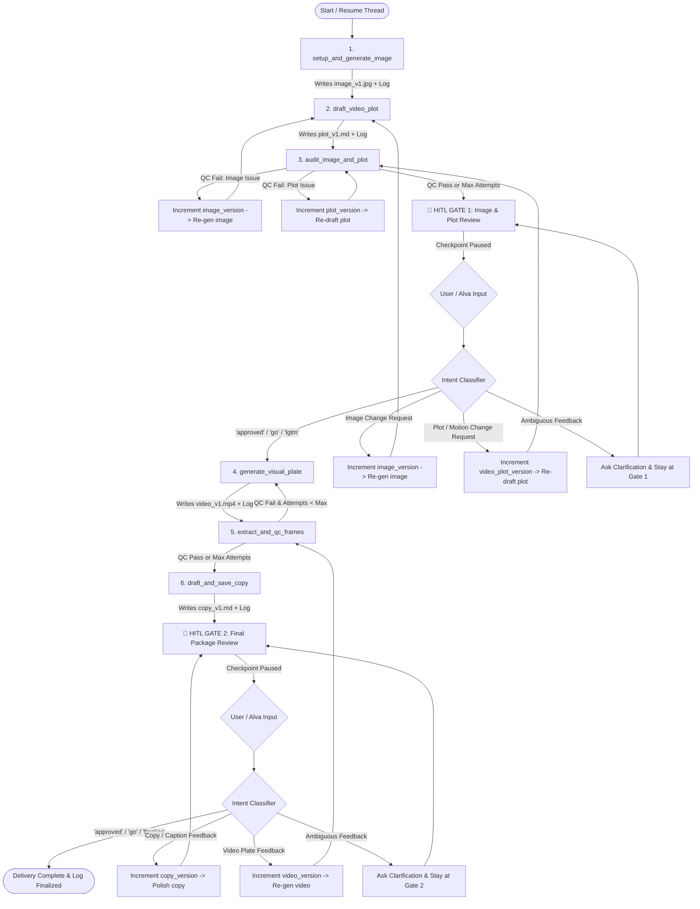

# 🚀 Proposal: Content Creation Multi-Turn Pipeline with Dual-Asset QC & Versioned Feedback Loops

## 1. Executive Summary

This proposal refines the `content_creation` graph into an **interactive, multi-turn AI production studio**:
- **Dual-Asset QC Audit (Node 3)**: Brand Editor audits **BOTH** the generated base image and the video plot against the QC playbook. If QC fails, the graph selectively routes back to `setup_and_generate_image` (if image fails) or `draft_video_plot` (if plot fails) with version increments.
- **Lowercase Folder Conventions**: Lowercase folder and asset paths (`words/{topic}`, e.g. `words/fish/`).
- **Persistent State Checkpointing (`SqliteSaver`)**: Thread-scoped persistence allowing multi-turn conversational pauses and resumptions that survive process restarts.
- **Intelligent Feedback Routing & Asset Versioning**:
  - Incremental versioning for all generated assets (`_v1`, `_v2`, `_v3`, etc.).
  - Context-aware intent classification routing human revisions to either **Image**, **Video Plot**, **Video Plate**, or **Copywriting** nodes without redundant re-generation.
- **Ambiguous Input Clarification**: Prompts the user for clarification if feedback intent is ambiguous rather than making destructive assumptions.
- **Continuous Audit Logging (`execution_log.md`)**: Full trace of prompts, QC audits, human feedback, and version progressions saved in the topic's PKM directory.

---

## 2. Updated State Schema (`ContentCreationState`)

```python
from typing import TypedDict, List, Dict, Any, Annotated, Sequence, Optional, Literal
import operator
from langchain_core.messages import BaseMessage

class ContentCreationState(TypedDict, total=False):
    # --- Project Context & Threading ---
    project_dir: str                  # e.g., "pkm/wiki/software/ayla-first-words"
    topic: str                        # e.g., "fish" (always lowercased)
    session_id: str                   # e.g., "session_1"
    thread_id: str                    # Standard thread identifier

    # --- Instruction Documents ---
    manifest_path: str                # e.g., "{project_dir}/01_Project_Manifest.md"
    creator_instructions_path: str    # e.g., "{project_dir}/02_Creator_Instructions.md"
    qc_playbook_path: str             # e.g., "{project_dir}/03_QC_Playbook.md"
    execution_log_path: str           # e.g., "{output_dir}/execution_log.md"

    # --- Asset Paths & Versioning ---
    output_dir: str                   # e.g., "{project_dir}/words/{topic}" (lowercased)
    image_version: int                # e.g., 1, 2, 3
    video_plot_version: int           # e.g., 1, 2, 3
    video_version: int                # e.g., 1, 2, 3
    copy_version: int                 # e.g., 1, 2, 3
    
    image_path: str                   # e.g., "{output_dir}/{topic}_image_v{image_version}.jpg"
    video_plot_path: str              # e.g., "{output_dir}/{topic}_video_plot_v{video_plot_version}.md"
    video_path: str                   # e.g., "{output_dir}/{topic}_video_v{video_version}.mp4"
    copy_path: str                    # e.g., "{output_dir}/{topic}_copy_v{copy_version}.md"

    # --- Internal Graph State & QC ---
    image_prompt: str
    video_plot_content: str
    video_plot_qc_passed: bool
    video_plot_feedback: str
    qc_rejection_target: Literal["image", "plot", "both"]
    
    extracted_frames: List[str]       # Generated by extract_video_frames
    qc_timestamps: List[float]        # Configurable timestamps (default [1.0, 2.5, 4.0])
    video_qc_passed: bool
    video_qc_feedback: str
    
    copy_text: str
    final_package: Dict[str, Any]

    # --- HITL Multi-Turn Feedback State ---
    gate1_decision: Literal["approved", "revise_image", "revise_plot", "clarify"]
    gate2_decision: Literal["approved", "revise_copy", "revise_video", "clarify"]
    latest_human_feedback: str
    revision_history: List[Dict[str, Any]] # Timestamped feedback records
    clarification_question: str

    # --- Auxiliary / Runtime State ---
    video_plot_attempts: int
    max_video_plot_reviews: int
    video_qc_attempts: int
    max_video_reviews: int
    messages: Annotated[Sequence[BaseMessage], operator.add]
    query: str
    error_message: str
```

---

## 3. Architecture & Multi-Turn Flowchart



---

## 4. Dual-Asset QC Audit & Intent Routing

### Node 3: Dual-Asset QC Audit (`audit_video_plot_node` / `should_continue_image_and_plot_audit`)
Brand Editor evaluates both the generated Base Image (`image_path`, `image_prompt`) and the Video Plot (`video_plot_content`) against `qc_playbook_path`:
- **Compliance**: Sets `video_plot_qc_passed = True`, transitions forward to Gate 1.
- **Image Failure (`TARGET: IMAGE` or `TARGET: BOTH`)**: Increments `image_version` and loops back to Node 1 (`setup_and_generate_image`).
- **Plot Failure (`TARGET: PLOT`)**: Increments `video_plot_version` and loops back to Node 2 (`draft_video_plot`).

### Gate 1 Intent Classification Logic (`classify_gate1_intent`)
When user input is received at Gate 1:
1. **Approval Detection**:
   - Matches: `"approved"`, `"approve"`, `"go"`, `"proceed"`, `"yes"`, `"looks good"`, `"lgtm"`, `"pass"`, `"continue"`.
   - Action: Sets `gate1_decision = "approved"`, routes to `generate_visual_plate`.
2. **Image Revision Detection**:
   - Keywords/Context: `"image"`, `"character"`, `"face"`, `"bangs"`, `"hair"`, `"clothes"`, `"background"`, `"art style"`, `"look"`, `"pose"`.
   - Action: Increments `image_version` (e.g. `_v2.jpg`), sets `gate1_decision = "revise_image"`, routes to `setup_and_generate_image`.
3. **Video Plot Revision Detection**:
   - Keywords/Context: `"plot"`, `"motion"`, `"camera"`, `"zoom"`, `"mouth"`, `"lip-sync"`, `"speed"`, `"audio sync"`, `"script"`.
   - Action: Increments `video_plot_version` (e.g. `_v2.md`), sets `gate1_decision = "revise_plot"`, routes to `draft_video_plot` (retaining current image).
4. **Ambiguity Resolution**:
   - Sets `gate1_decision = "clarify"`. Prompts user for clarification and stays paused at Gate 1.

### Gate 2 Intent Classification Logic (`classify_gate2_intent`)
1. **Approval Detection**: Routes to `END` and completes final delivery.
2. **Copy Revision Detection**: Keywords: `"copy"`, `"caption"`, `"hashtag"`, `"hook"`, `"text"`, `"wording"`. Increments `copy_version` (e.g. `_v2.md`) and routes to `draft_and_save_copy`.
3. **Video Revision Detection**: Keywords: `"video"`, `"motion"`, `"re-render"`, `"animation"`. Increments `video_version` (e.g. `_v2.mp4`) and routes to `generate_visual_plate`.
4. **Ambiguity Resolution**: Prompts user for clarification regarding copy vs video changes.

---

## 5. Folder Hierarchy & Continuous Execution Log

### Lowercase Directory Structure
- All folder paths are strictly lowercased:
  - Output folder: `words/{topic.lower()}` (e.g. `pkm/wiki/software/ayla-first-words/words/fish/`)
  - Asset files: `words/{topic.lower()}/{topic.lower()}_image_v1.jpg`, `words/{topic.lower()}/{topic.lower()}_video_plot_v1.md`, etc.

### Continuous Execution Log (`execution_log.md`)
Location: `{output_dir}/execution_log.md` (e.g. `pkm/wiki/software/ayla-first-words/words/fish/execution_log.md`).

#### Log Sample:
```markdown
# 📜 Content Creation Trajectory: fish

- **Project Directory**: `pkm/wiki/software/ayla-first-words`
- **Output Directory**: `pkm/wiki/software/ayla-first-words/words/fish`
- **Initiated**: `2026-08-14 13:30:00 UTC`

---

## 🎨 [13:30:15] Step 1: Base Image (v1) — Content Creator
- **Action**: 1-Shot Base Image Prompt Generation
- **Output Asset**: `words/fish/fish_image_v1.jpg`

## 📝 [13:30:30] Step 2: Video Plot (v1) — Content Creator
- **Action**: Pure Visual Plate Script Authoring
- **Output Asset**: `words/fish/fish_video_plot_v1.md`

## 🧐 [13:30:45] Step 3: Dual-Asset QC Audit (Attempt 1) — Brand Editor
- **Verdict**: `REJECTED TARGET: IMAGE`
- **Audit Notes**: Character hair needs to be curly per instructions.

## 🎨 [13:31:00] Step 1: Base Image (v2) — Content Creator
- **Output Asset**: `words/fish/fish_image_v2.jpg`

## 🧐 [13:31:30] Step 3: Dual-Asset QC Audit (Attempt 2) — Brand Editor
- **Verdict**: `APPROVED`

## 🛑 [13:35:10] HITL Gate 1 Review — Human Decision
- **Feedback**: `"approved"`
- **Decision**: `APPROVED` (Proceeding to Step 4)
```
