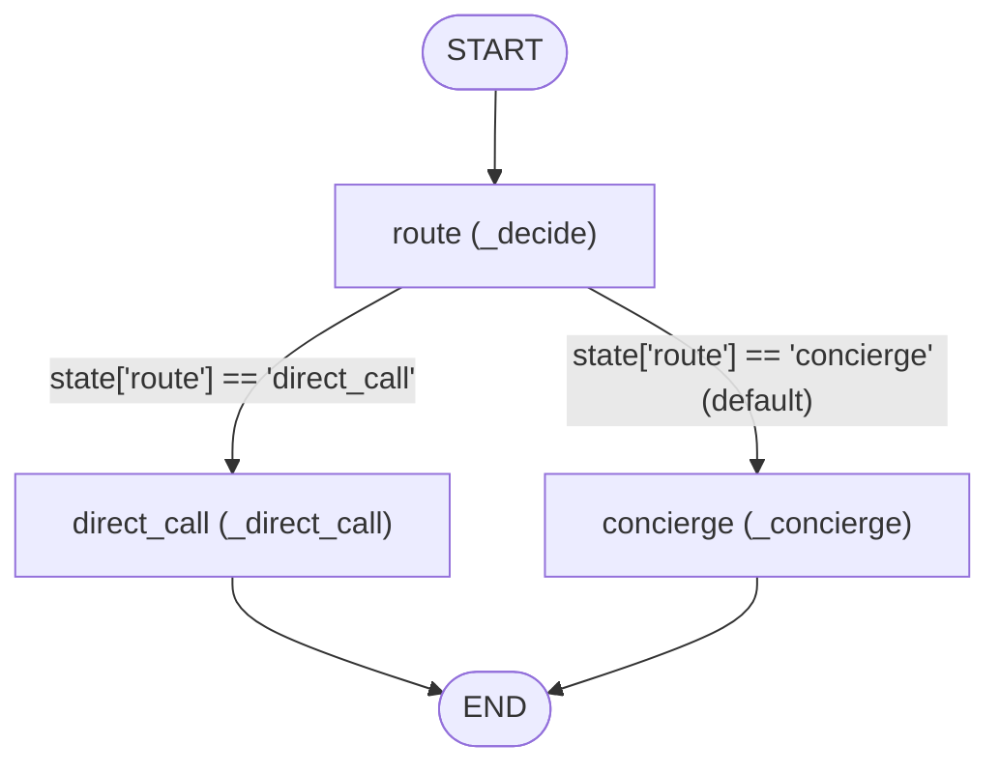

# Main Graph

`graphs/main` is the default LangGraph workflow for **every** agent in the
system: [`GraphBuilder.build_graph`](file:///Users/alvac/aoc/core/agent/graph_builder.py#L129-L144)
reads `config.get("graph", "main")` and no `agent.json` currently overrides it.
The graph puts a deterministic router in front of the conversational ReAct
agent, so a turn whose answer is already fixed by configuration — a channel in
which exactly one specialist is allowed to answer — is delegated without any
model call, while a turn with a real decision in it still reaches the
concierge (the ReAct agent) as before. It runs on every message an agent
handles: Discord messages, scheduled jobs, `agent_call` delegations, and
`graph_call` invocations all execute through the compiled graph returned by
[create_graph](file:///Users/alvac/aoc/graphs/main/graph.py#L51-L154).

> [!IMPORTANT]
> Because this graph is shared by all agents, the router must stay **inert**
> for specialists. Any change here has to keep an agent that does not hold
> `agent_call`, or does not host the channel, on the concierge path — see
> [routing_enabled](file:///Users/alvac/aoc/graphs/main/router.py#L134-L152).

## Workflow



The conditional edge is
`lambda state: state.get("route") or CONCIERGE`, mapped to
`{DIRECT_CALL: DIRECT_CALL, CONCIERGE: CONCIERGE}`
([graph.py:L146-L150](file:///Users/alvac/aoc/graphs/main/graph.py#L146-L150)),
so a missing or empty `route` falls back to `concierge`.

The `concierge` node wraps an inner `create_react_agent(llm, tools, prompt=prompt)`
which runs its own model/tool loop internally; that loop is not expressed as
nodes of this graph.

## State

The state schema is `RouterState`, a subclass of `MessagesState`
([graph.py:L135-L138](file:///Users/alvac/aoc/graphs/main/graph.py#L135-L138)).

| Field | Type | Description |
| --- | --- | --- |
| `messages` | `list[BaseMessage]` (from `MessagesState`) | Conversation history. Nodes return new/updated messages; the compiled graph persists them via the checkpointer. |
| `route` | `str` | Route target chosen by `route`: `"direct_call"` or `"concierge"`. Read by the conditional edge. |
| `route_agent_id` | `Optional[str]` | Target agent id when the route is `direct_call`; `None` on the concierge path. |
| `route_reason` | `str` | Human-readable rule that fired (e.g. `"sole eligible agent in #receipts"`). Kept for logs and tests, not consumed by any edge. |

## Nodes

### `route`

[_decide](file:///Users/alvac/aoc/graphs/main/graph.py#L58-L91) — resolves the
route and stashes it for the conditional edge. Synchronous and model-free.

- **Inputs from state:** `messages` (only the last message's `content` is
  inspected, as `latest`).
- **Other inputs:** the ambient
  [`ExecutionContext`](file:///Users/alvac/aoc/core/agent/execution_context.py#L40-L57)
  via `try_context()` (for `agent_id` and `channel_name`), the agent config
  captured at build time, and a fresh
  [`AgentsLoader`](file:///Users/alvac/aoc/core/loaders/agents_loader.py#L77-L124)
  as the routing-table source. When there is no active context it falls back to
  `owner_agent_id` (from `agent_id`/`config["agent_id"]`/`config["id"]`) and an
  empty channel name — which makes `routing_enabled` false, i.e. concierge.
- **Writes to state:** `route`, `route_agent_id`, `route_reason`; and
  `messages` **only** when the route is `concierge` *and* the decision rewrote
  the prompt (a bracketed escape prefix was stripped). In that case the last
  message is replaced with `model_copy(update={"content": decision.prompt})`,
  so the concierge is handed the request without the routing syntax.
- **Side effects:** prints `[graphs.main] Routing to '<agent>' (<reason>)` when
  the decision is direct.
- **Routes to:** `direct_call` or `concierge`.

### `direct_call`

[_direct_call](file:///Users/alvac/aoc/graphs/main/graph.py#L93-L126) — hands
the turn to the one agent allowed to answer in this channel. Async.

- **Inputs from state:** `messages[-1].content` as the user prompt,
  `route_agent_id` as the delegation target.
- **Other inputs:** the ambient context for `channel_name` and the calling
  `agent_id` (falling back to `owner_agent_id`).
- **Behavior:** awaits
  [stream_delegate](file:///Users/alvac/aoc/core/agent/delegation.py#L114-L254),
  the single shared delegation path (also used by the `agent_call` tool), so
  the streamed header, custom events, channel-permission check and `<caller>`
  prefix are identical on both paths.
  - On failure it does **not** raise: it logs to stderr and returns
    `AIMessage("Could not reach \`<target>\`: <error>")`, because a
    misconfigured channel should say so in the channel rather than crash the
    graph ([graph.py:L109-L113](file:///Users/alvac/aoc/graphs/main/graph.py#L109-L113)).
  - On success the reply text is prefixed with
    [agent_header](file:///Users/alvac/aoc/core/agent/delegation.py#L107-L111)
    (`emoji Name: `). Attribution matters: this text becomes part of the
    orchestrator's own history, and an unattributed reply would later read as
    something the orchestrator itself said and reasoned its way to.
  - When a context is active it calls
    [_record_turn](file:///Users/alvac/aoc/graphs/main/graph.py#L30-L48), which
    appends the `user` and `ai` messages to `SqliteSessionStore`. This is
    needed because the session log is populated by `LoggingHandler`'s *LLM*
    callbacks, and a routed turn never calls a model — without it the
    transcript would skip every deterministic exchange.
- **Writes to state:** `messages` — a single `AIMessage` with the attributed
  text (or `result.text`, or the error message).
- **Routes to:** `END`.

### `concierge`

[_concierge](file:///Users/alvac/aoc/graphs/main/graph.py#L128-L133) — the
existing ReAct behaviour, for turns with a real decision in them. Async.

- **Inputs from state:** `messages` (the full list, including any prompt
  rewritten by `route`), plus the LangGraph `config` passed through as
  `config_`.
- **Behavior:** awaits `concierge_agent.ainvoke({"messages": existing}, config_)`
  where `concierge_agent = create_react_agent(llm, tools, prompt=prompt)` was
  built once in `create_graph`, then slices off only the messages the inner
  agent produced (`result["messages"][len(existing):]`) so the pre-existing
  history is not re-emitted into the outer state.
- **Writes to state:** `messages` — only the newly produced messages.
- **Routes to:** `END`.

## Routing

All routing logic lives in [router.py](file:///Users/alvac/aoc/graphs/main/router.py)
and is deliberately pure: `decide()` is a function of
`(prompt, agent_id, channel_name, agent_config, loader)` and performs no work
and no network I/O, so the routing table is something a test can pin.

[decide](file:///Users/alvac/aoc/graphs/main/router.py#L155-L178) returns a
frozen [RouteDecision](file:///Users/alvac/aoc/graphs/main/router.py#L42-L57)
(`target`, `agent_id`, `prompt`, `reason`; `is_direct` is a convenience
property). `reason` exists for logs and tests: when routing is wrong, the
useful question is *which rule fired*.

### Decision table (evaluated top to bottom)

| Condition | Route | `agent_id` | `reason` |
| --- | --- | --- | --- |
| `routing_enabled(...)` is false | `concierge` | `None` | `routing not enabled for this agent/channel` |
| Prompt matches a configured concierge prefix | `concierge` | `None` | `concierge prefix '<prefix>'` |
| Exactly 1 eligible agent in the channel | `direct_call` | that agent | `sole eligible agent in #<channel>` |
| 0 or ≥2 eligible agents | `concierge` | `None` | `<n> eligible agents in #<channel>` |

### `routing_enabled`

[routing_enabled](file:///Users/alvac/aoc/graphs/main/router.py#L134-L152)
requires all three:

1. a non-empty `agent_id` **and** non-empty `channel_name`;
2. `"agent_call"` present in `agent_config["tools"]`;
3. `loader.hosts_channel(agent_id, channel_name)` — i.e. the channel is listed
   in the agent's `channel_hosts`
   ([agents_loader.py:L77-L85](file:///Users/alvac/aoc/core/loaders/agents_loader.py#L77-L85)).

This is *derived rather than declared* on purpose: because `graphs/main` is the
default graph for every agent, a flag in one agent's config would not have
scoped it and a flag in every agent's config would be a migration. Holding
`agent_call` means the agent's purpose includes delegating; hosting the channel
means untagged messages arrive there by default. Only an orchestrator satisfies
both — a specialist holds no `agent_call`, and an agent hosting its own channel
has no other eligible agent in it anyway.

### Escape prefixes (`concierge_prefixes`)

The openers that mean "don't route this, answer it here" are read from the
agent's config under
[`PREFIX_CONFIG_KEY = "concierge_prefixes"`](file:///Users/alvac/aoc/graphs/main/router.py#L39),
not hard-coded, because which phrases belong there depends on which tools that
agent holds (`kill` earns its place only because `main` has `job_kill`) — and
that is config, not logic.
[concierge_prefixes](file:///Users/alvac/aoc/graphs/main/router.py#L94-L99)
accepts a list or a single string and drops blanks and non-strings.

Two forms, matched by
[match_concierge_prefix](file:///Users/alvac/aoc/graphs/main/router.py#L107-L131)
(case-insensitive, in declaration order, first match wins):

| Form | Example | Anchoring | Prompt handed to the concierge |
| --- | --- | --- | --- |
| Bracketed (`[...]`) | `"[main] what did we decide?"` | Matches on sight — `]` is its own boundary | Prefix **stripped**: `"what did we decide?"` |
| Bare word | `"kill job abc123"` | Must equal the message or be followed by a space | Prompt **kept** verbatim — the concierge needs the verb to act on it |

Anchoring for bare entries prevents `"killing time before the flight"` being
read as a command. Bare entries should stay short and few: a loose list
silently steals ordinary messages from the specialist, which is worse than
missing a few.

Prompt handling is multimodal-safe:
[leading_text](file:///Users/alvac/aoc/graphs/main/router.py#L60-L74) reads only
the leading text part of a content-part list, and
[_replace_leading_text](file:///Users/alvac/aoc/graphs/main/router.py#L77-L91)
rewrites that part while preserving attachments.

### Resolving the target agent

When routing is enabled and no prefix matched, the target comes from
[eligible_agents_for_channel(channel_name, exclude_agent_id=agent_id)](file:///Users/alvac/aoc/core/loaders/agents_loader.py#L87-L114):
agents whose `channels` list contains the channel, **excluding** the caller
itself and **excluding** agents declaring `channels: ["*"]` (a wildcard is a
statement about reachability, not ownership — counting `graph-worker` would
make every channel look crowded and disable routing entirely). The result is
sorted for stability. Exactly one survivor ⇒ `direct_call`; otherwise the
choice is real and the concierge decides.

> [!NOTE]
> `direct_call` delegation is still permission-checked downstream:
> [channel_permits](file:///Users/alvac/aoc/core/agent/delegation.py#L101-L104)
> inside `stream_delegate` rejects a target whose `channels` grant does not
> cover the channel, and the node reports that as the turn's reply.

## Entry & Exit

Both helpers are picked up by name by
[GraphsLoader](file:///Users/alvac/aoc/core/loaders/graphs_loader.py#L80-L97)
and used by the [`graph_call`](file:///Users/alvac/aoc/tools/graph_call.py#L40-L42)
tool when this graph is invoked as a subgraph. (The normal agent path in
[`Agent._prepare_execution`](file:///Users/alvac/aoc/core/agent/agent.py#L113)
builds `{"messages": [...]}` itself and does not call them.)

```python
def prepare_input(query: str, caller: Optional[str] = None, **kwargs) -> Dict[str, Any]
```

Returns `{"messages": [{"role": "user", "content": formatted_query}]}`. When
`caller` is given and the query does not already contain `<caller>`, the query
is prefixed with `<caller>{caller}</caller>\n`; the guard makes it idempotent
so a re-entering prompt is not double-tagged
([graph.py:L157-L165](file:///Users/alvac/aoc/graphs/main/graph.py#L157-L165)).

```python
def format_output(state: Dict[str, Any]) -> str
```

Returns `state["messages"][-1].content` when `state` is a dict with a non-empty
`messages`; otherwise falls back to `str(state)`
([graph.py:L168-L172](file:///Users/alvac/aoc/graphs/main/graph.py#L168-L172)).

### Checkpointer ownership

```python
concierge_agent = create_react_agent(llm, tools, prompt=prompt)   # no checkpointer
...
return workflow.compile(checkpointer=checkpointer)                # outer graph owns it
```

> [!IMPORTANT]
> The checkpointer belongs to this **outer** graph. The inner ReAct agent is
> compiled without one — otherwise the two would write the same thread from two
> levels. `GraphBuilder` passes a
> [`SqliteCheckpointer`](file:///Users/alvac/aoc/core/agent/graph_builder.py#L125)
> in, and the thread id comes from
> [`ExecutionContext.get_session_thread_id()`](file:///Users/alvac/aoc/core/agent/execution_context.py#L218-L230).

A consequence of this design is that the `direct_call` node has to write the
human-readable session log itself (`_record_turn`), since the checkpoint is
handled automatically by the compiled graph but `SqliteSessionStore` is only
populated by LLM callbacks that a routed turn never triggers.

## Files

| File | Description |
| --- | --- |
| [graph.py](file:///Users/alvac/aoc/graphs/main/graph.py) | Builds and compiles the workflow: the `route`, `direct_call` and `concierge` nodes, `RouterState`, plus `prepare_input`/`format_output`. |
| [router.py](file:///Users/alvac/aoc/graphs/main/router.py) | Pure routing logic: `decide()`, `routing_enabled()`, escape-prefix matching, and the `RouteDecision` dataclass. |
| [graph.json](file:///Users/alvac/aoc/graphs/main/graph.json) | Graph metadata consumed by `GraphsLoader`: `graph_id`/`name` `main`, description, emoji 🧭, no extra tool grants, `dream` skill. |

### Tests

| File | Description |
| --- | --- |
| [test_main_graph.py](file:///Users/alvac/aoc/tests/graphs/main/test_main_graph.py) | Runs the compiled graph with doubles: direct call without a model, reply attribution, ambiguous channel → concierge, prefix stripping, turn recording, failed delegation, and that specialists never route. |
| [test_router.py](file:///Users/alvac/aoc/tests/graphs/main/test_router.py) | Unit-tests `decide()`, `routing_enabled()` and prefix matching, and pins the live routing table against the real `agents/` configs. |
